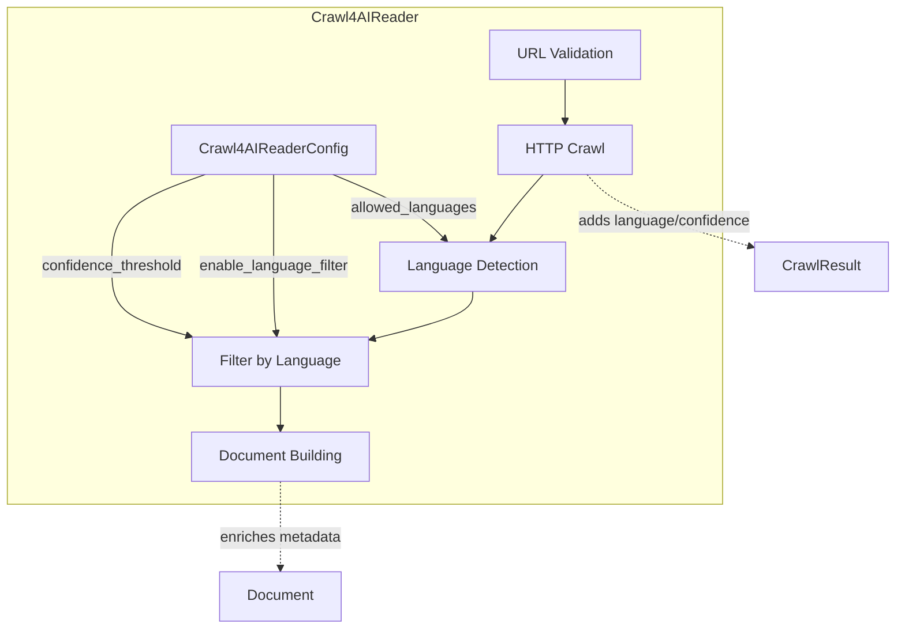
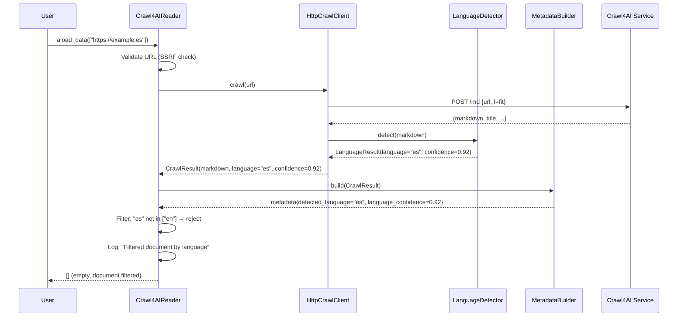

# Design: Language Filtering for Web-Crawled Documents

## Overview

Add post-crawl language detection using fast-langdetect (95% accuracy, ~1-2ms overhead) to filter non-English documents in the Crawl4AIReader pipeline. Extends existing architecture with zero breaking changes by adding 3 config fields to Crawl4AIReaderConfig, 2 fields to CrawlResult, a LanguageDetector component, and filtering logic in _aload_batch() after line 648.

## Design Inputs

**User Interview Responses:**
- **Architecture preference**: Extend existing architecture (minimal changes to current patterns)
- **Technology constraints**: None (use fast-langdetect as recommended)

## Architecture



## Components

### LanguageDetector

**Purpose**: Fast language detection using fast-langdetect library

**Responsibilities**:
- Detect primary language of markdown text
- Return language code and confidence score
- Handle edge cases (empty text, short text, detection errors)

**Interface**:
```python
@dataclass
class LanguageResult:
    """Language detection result."""
    language: str  # ISO 639-1 code ("en", "es", "fr", etc.) or "unknown"
    confidence: float  # 0.0-1.0, 0.0 for unknown/error

class LanguageDetector:
    """Fast language detection using fast-langdetect."""

    def __init__(self, min_text_length: int = 50) -> None:
        """Initialize detector.

        Args:
            min_text_length: Skip detection for text shorter than this (default: 50)
        """

    def detect(self, text: str) -> LanguageResult:
        """Detect language and confidence.

        Args:
            text: Markdown content to analyze

        Returns:
            LanguageResult with language code and confidence

        Edge Cases:
            - Empty text: LanguageResult(language="unknown", confidence=0.0)
            - Short text (< min_text_length): LanguageResult(language="unknown", confidence=0.0)
            - Detection error: LanguageResult(language="unknown", confidence=0.0)
            - Multi-language: Primary language (highest confidence)
        """
```

**File**: `crawl4r/readers/crawl/language_detector.py` (new, ~80 lines)

**Dependencies**: `fast-langdetect>=0.4.0`

**Error Handling**: Fail-open (return unknown on error, log warning)

**Performance**: ~1-2ms per document, thread-safe (no async needed)

### CrawlResult Updates

**Purpose**: Store language detection results

**Changes**:
```python
@dataclass
class CrawlResult:
    """Result of crawling a single URL."""
    url: str
    markdown: str
    success: bool
    title: str | None = None
    description: str | None = None
    status_code: int = 0
    error: str | None = None
    timestamp: str = field(default_factory=_default_timestamp)
    internal_links_count: int = 0
    external_links_count: int = 0

    # NEW FIELDS (P1)
    detected_language: str | None = None  # ISO 639-1 code or "unknown"
    language_confidence: float | None = None  # 0.0-1.0
```

**File**: `crawl4r/readers/crawl/models.py` (modify existing, +2 fields)

**Backward Compatibility**: Optional fields with None defaults (zero breaking changes)

### Crawl4AIReaderConfig Updates

**Purpose**: Configure language filtering behavior

**Changes**:
```python
class Crawl4AIReaderConfig(BaseModel):
    """Configuration for Crawl4AI reader."""

    # ... existing fields ...

    # NEW FIELDS (P0)
    enable_language_filter: bool = Field(
        default=True,
        description="Enable language filtering (True) or disable for testing (False)",
    )
    allowed_languages: list[str] = Field(
        default=["en"],
        description="List of ISO 639-1 language codes to accept (e.g., ['en', 'es', 'fr'])",
    )
    language_confidence_threshold: float = Field(
        default=0.5,
        ge=0.0,
        le=1.0,
        description="Minimum confidence score to accept (0.0-1.0, default: 0.5)",
    )
```

**File**: `crawl4r/readers/crawl4ai.py` (modify existing, +3 fields)

**Validation**: Pydantic validators ensure 0.0 ≤ confidence ≤ 1.0

**Backward Compatibility**: Default values match current behavior (English only)

### Crawl4AIReader Updates

**Purpose**: Integrate language detection and filtering

**Changes**:

1. **Add LanguageDetector instance** (line ~256):
```python
self._language_detector = LanguageDetector(min_text_length=50)
```

2. **Add filtering logic in _aload_batch()** (after line 648):
```python
# NEW: Filter by language (if enabled)
if self.enable_language_filter:
    filtered_results = []
    for doc in results:
        if doc is None:
            filtered_results.append(None)
            continue

        # Get language from metadata (already enriched by MetadataBuilder)
        detected_language = doc.metadata.get("detected_language", "unknown")
        language_confidence = doc.metadata.get("language_confidence", 0.0)

        # Filter by allowed languages and confidence
        if (detected_language in self.allowed_languages and
            language_confidence >= self.language_confidence_threshold):
            filtered_results.append(doc)
        else:
            # Log filtered document
            self._logger.info(
                f"Filtered document by language: {doc.metadata.get('source_url')}",
                extra={
                    "url": doc.metadata.get("source_url"),
                    "detected_language": detected_language,
                    "confidence": language_confidence,
                    "reason": "language_filter",
                },
            )
            filtered_results.append(None)

    results = filtered_results
```

**File**: `crawl4r/readers/crawl4ai.py` (modify existing, +30 lines in _aload_batch)

**Performance**: < 5ms overhead per document batch (detection is 1-2ms per doc, done in parallel)

### MetadataBuilder Updates

**Purpose**: Enrich metadata with language fields

**Changes**:
```python
def build(self, result: CrawlResult) -> dict[str, str | int | float]:
    """Build metadata dictionary from crawl result."""
    metadata = {
        "source": result.url,
        "source_url": result.url,
        "title": result.title or "",
        "description": result.description or "",
        "status_code": result.status_code,
        "crawl_timestamp": result.timestamp,
        "internal_links_count": result.internal_links_count,
        "external_links_count": result.external_links_count,
        "source_type": "web_crawl",
    }

    # NEW: Add language metadata (P1)
    if result.detected_language is not None:
        metadata["detected_language"] = result.detected_language
    if result.language_confidence is not None:
        metadata["language_confidence"] = result.language_confidence

    return metadata
```

**File**: `crawl4r/readers/crawl/metadata_builder.py` (modify existing, +5 lines)

**Backward Compatibility**: Only adds fields when present in CrawlResult

### HttpCrawlClient Updates

**Purpose**: Perform language detection after crawl, before returning CrawlResult

**Changes** (in `crawl()` method after line 52):
```python
async def crawl(self, url: str) -> CrawlResult:
    """Crawl URL using Crawl4AI service."""
    try:
        async with httpx.AsyncClient(timeout=self.timeout) as client:
            response = await client.post(
                f"{self.endpoint_url}/md",
                json={"url": url, "f": "fit"},
            )

            if response.status_code == 200:
                data = response.json()
                markdown = data.get("markdown", "")

                # NEW: Detect language (if detector provided)
                detected_language = None
                language_confidence = None
                if self.language_detector is not None:
                    lang_result = self.language_detector.detect(markdown)
                    detected_language = lang_result.language
                    language_confidence = lang_result.confidence

                return CrawlResult(
                    url=url,
                    markdown=markdown,
                    title=data.get("title"),
                    description=data.get("description"),
                    status_code=200,
                    success=True,
                    detected_language=detected_language,
                    language_confidence=language_confidence,
                )
            # ... rest unchanged ...
```

**Constructor update**:
```python
def __init__(
    self,
    endpoint_url: str,
    timeout: float = 60.0,
    language_detector: LanguageDetector | None = None,  # NEW
) -> None:
    self.endpoint_url = endpoint_url.rstrip("/")
    self.timeout = timeout
    self.language_detector = language_detector  # NEW
```

**File**: `crawl4r/readers/crawl/http_client.py` (modify existing, +15 lines)

**Pass detector from Crawl4AIReader.__init__** (line ~268):
```python
self._http_client = HttpCrawlClient(
    endpoint_url=self.endpoint_url,
    timeout=float(self.timeout_seconds),
    language_detector=self._language_detector,  # NEW
)
```

## Data Flow



**Steps**:
1. User calls `aload_data(urls)`
2. Reader validates URLs (existing SSRF protection)
3. HttpCrawlClient fetches markdown from Crawl4AI service (existing)
4. **NEW**: LanguageDetector analyzes markdown → LanguageResult
5. **NEW**: HttpCrawlClient populates CrawlResult with language fields
6. MetadataBuilder enriches metadata (existing + new language fields)
7. Document created with full metadata (existing)
8. **NEW**: Reader filters by allowed_languages + confidence_threshold
9. **NEW**: Rejected documents logged with structured info
10. Reader returns only accepted documents to user

## Technical Decisions

| Decision | Options | Choice | Rationale |
|----------|---------|--------|-----------|
| **Library** | langdetect, langid, fasttext, fast-langdetect | **fast-langdetect** | 80x faster (1-2ms), 95% accuracy, thread-safe, 50KB model, no ML training needed |
| **Detection Point** | Pre-crawl, post-crawl, post-chunk | **Post-crawl** | Crawl markdown already lightweight (~12KB), detection only ~1-2ms, enables confidence thresholds |
| **Integration Point** | New reader class, wrapper, extend existing | **Extend existing** | Zero breaking changes, follows DRY, minimal code delta (~150 LOC total) |
| **Failure Mode** | Fail-closed, fail-open, configurable | **Fail-open** | Accept document if detection fails (log warning), prevents data loss from library bugs |
| **Metadata Storage** | CrawlResult only, metadata only, both | **Both** | CrawlResult for propagation, metadata for Qdrant indexing and search |
| **Default Behavior** | Enabled, disabled | **Enabled** | English-only is the stated requirement, opt-out for testing via config |
| **Short Text** | Detect, skip, configurable | **Skip** | < 50 chars likely fails detection, accept as unknown (fail-open) |

## File Structure

| File | Action | Purpose | Lines |
|------|--------|---------|-------|
| `crawl4r/readers/crawl/language_detector.py` | **Create** | LanguageDetector + LanguageResult | ~80 |
| `crawl4r/readers/crawl/models.py` | **Modify** | Add detected_language, language_confidence to CrawlResult | +2 |
| `crawl4r/readers/crawl4ai.py` | **Modify** | Add 3 config fields, initialize detector, add filtering logic | +35 |
| `crawl4r/readers/crawl/http_client.py` | **Modify** | Inject detector, call detect() after crawl | +15 |
| `crawl4r/readers/crawl/metadata_builder.py` | **Modify** | Enrich metadata with language fields | +5 |
| `crawl4r/core/metadata.py` | **Modify** | Add DETECTED_LANGUAGE, LANGUAGE_CONFIDENCE constants | +2 |
| `tests/unit/test_language_detector.py` | **Create** | Unit tests for LanguageDetector (15 tests) | ~400 |
| `tests/unit/test_crawl4ai_reader.py` | **Modify** | Add 8 integration tests for filtering | +250 |
| `pyproject.toml` | **Modify** | Add fast-langdetect>=0.4.0 dependency | +1 |

**Total New Code**: ~80 lines (language_detector.py)
**Total Modified Code**: ~57 lines across 5 files
**Total Test Code**: ~650 lines
**Total Change**: ~790 lines (production + tests)

## Interfaces

### LanguageResult (New)

```python
@dataclass
class LanguageResult:
    """Result of language detection.

    Attributes:
        language: ISO 639-1 language code ("en", "es", "fr", etc.) or "unknown"
        confidence: Confidence score 0.0-1.0, where 0.0 = unknown/error
    """
    language: str
    confidence: float
```

### LanguageDetector (New)

```python
class LanguageDetector:
    """Fast language detection using fast-langdetect library.

    Thread-safe, fail-open on errors (returns unknown), skips short text.

    Attributes:
        min_text_length: Minimum text length for detection (default: 50 chars)
    """

    def __init__(self, min_text_length: int = 50) -> None:
        """Initialize detector with minimum text length."""

    def detect(self, text: str) -> LanguageResult:
        """Detect primary language and confidence.

        Args:
            text: Markdown content to analyze

        Returns:
            LanguageResult with language code and confidence

        Examples:
            >>> detector = LanguageDetector()
            >>> result = detector.detect("This is English text")
            >>> assert result.language == "en"
            >>> assert result.confidence > 0.9

            >>> result = detector.detect("")  # Empty text
            >>> assert result.language == "unknown"
            >>> assert result.confidence == 0.0
        """
```

### CrawlResult Schema Update

```python
# Before (9 fields)
{
    "url": str,
    "markdown": str,
    "success": bool,
    "title": str | None,
    "description": str | None,
    "status_code": int,
    "error": str | None,
    "timestamp": str,
    "internal_links_count": int,
    "external_links_count": int,
}

# After (11 fields - backward compatible)
{
    # ... all existing fields unchanged ...
    "detected_language": str | None,  # NEW: ISO 639-1 code or "unknown"
    "language_confidence": float | None,  # NEW: 0.0-1.0
}
```

### Document Metadata Schema Update

```python
# Before (9 fields)
{
    "source": str,
    "source_url": str,
    "title": str,
    "description": str,
    "status_code": int,
    "crawl_timestamp": str,
    "internal_links_count": int,
    "external_links_count": int,
    "source_type": str,
}

# After (11 fields - backward compatible, only when language detected)
{
    # ... all existing fields unchanged ...
    "detected_language": str,  # NEW: ISO 639-1 code or "unknown"
    "language_confidence": float,  # NEW: 0.0-1.0
}
```

### Config Schema Update

```python
# Crawl4AIReaderConfig additions (3 new fields)
{
    # ... existing 7 fields unchanged ...
    "enable_language_filter": bool,  # Default: True
    "allowed_languages": list[str],  # Default: ["en"]
    "language_confidence_threshold": float,  # Default: 0.5 (range: 0.0-1.0)
}
```

## Error Handling

| Scenario | Strategy | Impact |
|----------|----------|--------|
| **Detection library error** | Catch exception → LanguageResult(unknown, 0.0), log warning | Document accepted (fail-open) |
| **Empty text** | Skip detection → LanguageResult(unknown, 0.0) | Document accepted |
| **Short text (< 50 chars)** | Skip detection → LanguageResult(unknown, 0.0) | Document accepted |
| **Low confidence** | Filter if < threshold, log info | Document rejected (user-configurable) |
| **Unknown language** | Treat as language="unknown" | Document rejected unless "unknown" in allowed_languages |
| **Import error (fast-langdetect)** | Raise ImportError at __init__ | Fail fast (dependency missing) |
| **Multi-language content** | Return primary (highest confidence) | Best-effort (single language per doc) |

**Logging Pattern** (follows existing structured logging):

```python
# Success
self._logger.debug(
    f"Detected language: {language}",
    extra={
        "url": url,
        "detected_language": language,
        "confidence": confidence,
    },
)

# Filter
self._logger.info(
    f"Filtered document by language: {url}",
    extra={
        "url": url,
        "detected_language": language,
        "confidence": confidence,
        "allowed_languages": self.allowed_languages,
        "threshold": self.language_confidence_threshold,
        "reason": "language_filter",
    },
)

# Detection error
self._logger.warning(
    f"Language detection failed for {url}",
    extra={
        "url": url,
        "error": str(e),
        "fallback": "unknown",
    },
)
```

## Edge Cases

| Case | Handling | Test Coverage |
|------|----------|---------------|
| **Empty string** | Skip detection, return unknown/0.0, accept | `test_detect_empty_text()` |
| **Whitespace only** | Skip detection, return unknown/0.0, accept | `test_detect_whitespace_only()` |
| **Short text (< 50 chars)** | Skip detection, return unknown/0.0, accept | `test_detect_short_text()` |
| **Very long text (> 1MB)** | Detect (fast-langdetect handles this), may be slower | `test_detect_large_document()` |
| **Multi-language content** | Return primary language (highest confidence) | `test_detect_multilingual()` |
| **Code-heavy markdown** | Detect (may return low confidence), filter if needed | `test_detect_code_heavy()` |
| **Non-Latin scripts** | Detect (supports 50+ languages including CJK, Arabic, Cyrillic) | `test_detect_non_latin_scripts()` |
| **Detection exception** | Catch, return unknown/0.0, log warning, accept | `test_detect_library_error()` |
| **Confidence exactly at threshold** | Accept (>= threshold) | `test_filter_exact_threshold()` |
| **allowed_languages=[]** | Filter all documents | `test_filter_empty_allowed_list()` |
| **enable_language_filter=False** | Skip filtering, accept all | `test_filtering_disabled()` |

## Test Strategy

### Unit Tests: LanguageDetector (15 tests, ~400 LOC)

**File**: `tests/unit/test_language_detector.py`

```python
# Basic detection
test_detect_english_text()          # English → "en", confidence > 0.9
test_detect_spanish_text()          # Spanish → "es", confidence > 0.9
test_detect_french_text()           # French → "fr", confidence > 0.9
test_detect_multi_language()        # Mixed → primary language

# Edge cases
test_detect_empty_text()            # "" → unknown/0.0
test_detect_whitespace_only()       # "   \n\t" → unknown/0.0
test_detect_short_text()            # < 50 chars → unknown/0.0
test_detect_code_heavy()            # Mostly code → low confidence or unknown

# Error handling
test_detect_library_error()         # Mock exception → unknown/0.0, log warning

# Performance
test_detect_performance()           # 1000 docs < 5s (avg < 5ms)

# Configuration
test_min_text_length_configurable() # Custom threshold works
test_detect_non_latin_scripts()     # CJK, Arabic, Cyrillic

# Determinism
test_detect_deterministic()         # Same input → same output
test_detect_thread_safe()           # Parallel calls work
```

### Integration Tests: Crawl4AIReader (8 tests, ~250 LOC)

**File**: `tests/unit/test_crawl4ai_reader.py` (add to existing suite)

```python
# Config
test_config_has_language_fields()   # 3 new fields exist with correct defaults

# Filtering behavior
test_filter_by_allowed_languages()  # Only allowed languages pass
test_filter_by_confidence()         # Low confidence filtered
test_filter_disabled()              # enable_language_filter=False accepts all

# Metadata enrichment
test_metadata_includes_language()   # detected_language + language_confidence in metadata

# Logging
test_filtered_documents_logged()    # Structured logging for filtered docs

# Backward compatibility
test_language_fields_optional()     # CrawlResult with None values works
test_metadata_backward_compatible() # Old metadata schema still valid
```

### E2E Tests (Future - Integration with Crawl4AI Service)

```python
# tests/integration/test_e2e_language_filter.py
test_e2e_english_url_accepted()     # Real English webpage passes
test_e2e_spanish_url_filtered()     # Real Spanish webpage filtered
test_e2e_multi_language_config()    # ["en", "es"] accepts both
```

### Coverage Target

- **Unit tests**: 100% coverage of LanguageDetector
- **Integration tests**: 85%+ coverage of filtering logic in Crawl4AIReader
- **Overall**: 85%+ project coverage maintained

### Performance Benchmarks

```python
# tests/performance/test_language_detection_perf.py
def test_detection_overhead_p95():
    """Verify p95 detection time < 5ms per document."""
    docs = generate_test_docs(n=1000, avg_length=10000)
    detector = LanguageDetector()

    times = []
    for doc in docs:
        start = time.perf_counter()
        detector.detect(doc)
        times.append((time.perf_counter() - start) * 1000)  # Convert to ms

    p95 = sorted(times)[int(0.95 * len(times))]
    assert p95 < 5.0, f"p95 detection time {p95:.2f}ms exceeds 5ms threshold"

def test_memory_overhead():
    """Verify detector uses < 100KB memory."""
    detector = LanguageDetector()
    # Profile memory usage
    assert memory_usage(detector) < 100 * 1024  # 100KB
```

## Performance Considerations

| Metric | Target | Strategy |
|--------|--------|----------|
| **Detection latency (p95)** | < 5ms | fast-langdetect is 80x faster than langdetect |
| **Memory overhead** | < 100KB | fast-langdetect uses 50KB model |
| **Batch throughput** | No degradation | Detection runs in parallel with existing concurrency |
| **Thread safety** | Zero locks | fast-langdetect is thread-safe by design |
| **Async overhead** | Zero | Sync detection (< 5ms) in async context OK |

**Optimization**: Detection runs in HttpCrawlClient during the same async call that fetches markdown, so no additional round-trip delay.

**Benchmarking**: Include `test_detection_overhead_p95()` in CI to catch regressions.

## Security Considerations

| Concern | Mitigation |
|---------|------------|
| **SSRF via language metadata** | N/A - language detection doesn't introduce new attack vectors |
| **Injection via allowed_languages** | Pydantic validates as list[str], no execution risk |
| **DoS via large text** | fast-langdetect handles large inputs efficiently (1-2ms even for 1MB) |
| **Library supply chain** | Pin fast-langdetect>=0.4.0 in pyproject.toml, use lock file |

## Existing Patterns to Follow

**From codebase analysis:**

1. **Pydantic Config**: All config classes use `BaseModel`, `Field()`, validators
   - Example: `Crawl4AIReaderConfig` lines 70-140
   - Pattern: Default values, range validation (`ge`, `le`), descriptions

2. **Structured Logging**: Use `get_logger()`, include `extra={}` dict
   - Example: Line 256, 491-494, 560-562
   - Pattern: `extra={"url": url, "key": value}`

3. **Error Handling**: Fail-open for non-critical errors, structured logging
   - Example: HttpCrawlClient lines 68-75 (catch all, return CrawlResult with error)
   - Pattern: Try/except → return None or error object, log with context

4. **Dataclass Models**: Use `@dataclass` with type hints, optional fields
   - Example: `CrawlResult` lines 12-39
   - Pattern: Required fields first, optional with `= None`, `field(default_factory=...)`

5. **Component Extraction**: Small, focused classes (< 100 lines)
   - Example: `UrlValidator`, `MetadataBuilder`, `HttpCrawlClient`
   - Pattern: Single responsibility, injected dependencies

6. **Testing**: TDD with RED-GREEN-REFACTOR, fixture-based, descriptive names
   - Example: `test_crawl4ai_reader.py` lines 1-100
   - Pattern: `test_<component>_<scenario>()`, docstrings with FR references

7. **Backward Compatibility**: Optional fields with defaults, no removals
   - Example: CrawlResult has all optional fields except url, markdown, success
   - Pattern: New fields always optional, use `None` defaults

## Unresolved Questions

None. Design is complete and ready for implementation.

## Implementation Steps

1. Add `fast-langdetect>=0.4.0` to `pyproject.toml` dependencies
2. Create `crawl4r/readers/crawl/language_detector.py` with LanguageResult and LanguageDetector
3. Update `crawl4r/readers/crawl/models.py` to add detected_language and language_confidence fields to CrawlResult
4. Update `crawl4r/readers/crawl4ai.py` to add 3 config fields (enable_language_filter, allowed_languages, language_confidence_threshold)
5. Update `crawl4r/readers/crawl4ai.py` __init__ to initialize LanguageDetector instance
6. Update `crawl4r/readers/crawl/http_client.py` constructor to accept language_detector parameter
7. Update `crawl4r/readers/crawl/http_client.py` crawl() method to call detect() and populate CrawlResult fields
8. Update `crawl4r/readers/crawl4ai.py` __init__ to pass detector to HttpCrawlClient
9. Update `crawl4r/readers/crawl/metadata_builder.py` to enrich metadata with language fields
10. Update `crawl4r/readers/crawl4ai.py` _aload_batch() to add filtering logic after line 648
11. Update `crawl4r/core/metadata.py` to add DETECTED_LANGUAGE and LANGUAGE_CONFIDENCE constants
12. Create `tests/unit/test_language_detector.py` with 15 unit tests
13. Update `tests/unit/test_crawl4ai_reader.py` with 8 integration tests
14. Run `pytest tests/unit/test_language_detector.py -v` to verify unit tests
15. Run `pytest tests/unit/test_crawl4ai_reader.py -v -k language` to verify integration tests
16. Run `pytest --cov=crawl4r.readers.crawl.language_detector --cov-report=term` to verify coverage
17. Run `ruff check .` to verify linting
18. Run `ty check crawl4r/` to verify type checking
19. Append learnings to `./specs/language-filter/.progress.md`
