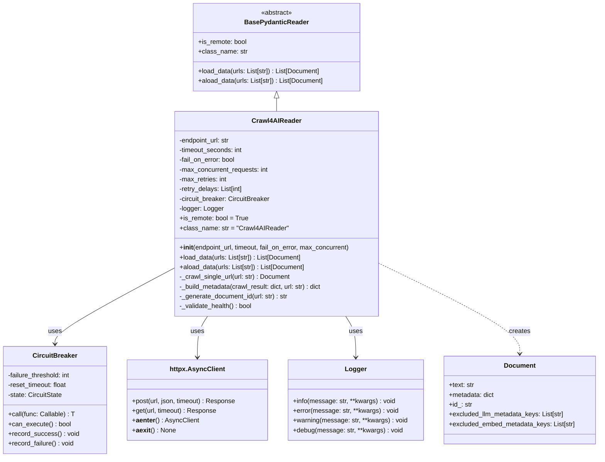
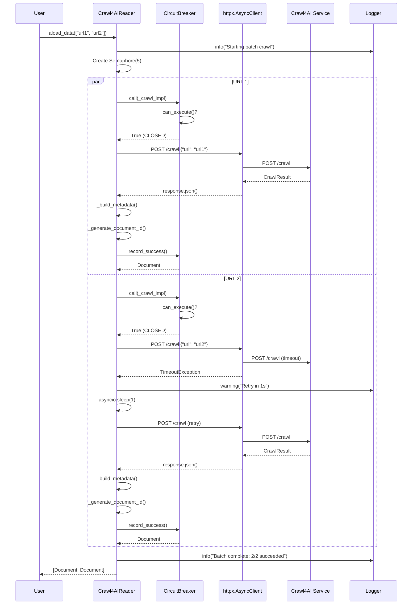

# Design: LlamaIndex Crawl4AI Reader

## Overview

The Crawl4AIReader is a production-ready LlamaIndex reader that integrates with the existing Crawl4AI Docker service to fetch web content as markdown-formatted documents. It extends `BasePydanticReader` for serialization support, implements async-first HTTP operations via `httpx.AsyncClient`, and reuses the project's existing circuit breaker, retry logic, and structured logging patterns. The reader generates deterministic Document IDs from URLs, enriches metadata for Qdrant compatibility, and provides both synchronous and asynchronous loading methods with comprehensive error handling.

## Scope

**This design covers the basic LlamaIndex Crawl4AI reader (v1)** with core functionality:

**In Scope:**
- Synchronous `/crawl` endpoint integration only
- Full-page document extraction (no pre-chunking)
- Explicit URL list handling (no link following/recursive crawling)
- Core metadata extraction (9 fields: source, source_url, title, description, status_code, timestamp, link counts, source_type)
- Circuit breaker pattern with retry logic
- Async batch processing with configurable concurrency
- Shared AsyncClient for connection pooling
- Health validation before batch operations
- Order-preserving results (includes None for failed URLs)

**Out of Scope (Deferred to Advanced Reader v2):**
- Async job endpoint (`/crawl/job`) with polling
- Webhook listener for job notifications
- Recursive link crawling with depth limits
- URL frontier and visited tracking
- Streaming endpoint (`/crawl/stream`) support
- Extended metadata extraction (author, keywords, language, Open Graph tags)
- Custom content filtering options (CSS selectors, excluded tags)
- Configurable cache modes beyond BYPASS

This focused scope enables delivery of a working reader in 2-3 days with proven patterns. Advanced features will be designed and implemented in a separate specification.

## Architecture



## Components

### Crawl4AIReader (Main Component)

**Purpose**: LlamaIndex reader for crawling web pages via Crawl4AI service and generating Documents

**Responsibilities**:
- Implement `BasePydanticReader` contract with `load_data()` and `aload_data()` methods
- Validate Crawl4AI service health on initialization
- Manage HTTP requests to Crawl4AI `/crawl` endpoint with configurable timeout
- Generate deterministic Document IDs from URLs using SHA256-derived UUIDs
- Extract markdown content from `CrawlResult.markdown.fit_markdown` field
- Build comprehensive metadata payloads compatible with Qdrant (flat types only)
- Handle concurrent URL processing with semaphore-based concurrency control
- Integrate circuit breaker pattern for fault tolerance
- Implement exponential backoff retry logic for transient failures
- Provide structured logging for all operations

**Interfaces**:

```python
from typing import List
from pydantic import Field
from llama_index.core.readers.base import BasePydanticReader
from llama_index.core.schema import Document
from rag_ingestion.circuit_breaker import CircuitBreaker
from rag_ingestion.logger import get_logger
import httpx
import hashlib
import asyncio
import uuid


class Crawl4AIReader(BasePydanticReader):
    """LlamaIndex reader for crawling web pages via Crawl4AI service.

    This reader integrates with the Crawl4AI Docker service to fetch web content
    as markdown-formatted documents. It supports both synchronous and asynchronous
    loading, concurrent processing with configurable limits, circuit breaker
    protection, and exponential backoff retry logic.

    Attributes:
        endpoint_url: Crawl4AI service endpoint URL (default: http://localhost:52004)
        timeout_seconds: HTTP request timeout in seconds (default: 60, range: 10-300)
        fail_on_error: Raise exception on first error vs. continue (default: False)
        max_concurrent_requests: Concurrency limit for batch processing (default: 5, range: 1-20)
        max_retries: Maximum retry attempts for transient errors (default: 3)
        retry_delays: Exponential backoff delays in seconds (default: [1, 2, 4])
        is_remote: LlamaIndex flag for remote data source (always True)
        class_name: LlamaIndex serialization class name (always "Crawl4AIReader")

    Examples:
        Basic usage with defaults:
            >>> reader = Crawl4AIReader()
            >>> docs = await reader.aload_data(["https://example.com"])
            >>> print(docs[0].metadata["title"])

        Custom configuration:
            >>> reader = Crawl4AIReader(
            ...     endpoint_url="http://crawl4ai:11235",
            ...     timeout_seconds=90,
            ...     fail_on_error=True,
            ...     max_concurrent_requests=10
            ... )
            >>> docs = reader.load_data(["https://site1.com", "https://site2.com"])
    """

    endpoint_url: str = Field(
        default="http://localhost:52004",
        description="Crawl4AI service endpoint URL"
    )
    timeout_seconds: int = Field(
        default=60,
        ge=10,
        le=300,
        description="HTTP request timeout in seconds (10-300)"
    )
    fail_on_error: bool = Field(
        default=False,
        description="Raise exception on first error (True) or skip failures (False)"
    )
    max_concurrent_requests: int = Field(
        default=5,
        ge=1,
        le=20,
        description="Maximum concurrent requests for batch processing (1-20)"
    )
    max_retries: int = Field(
        default=3,
        ge=0,
        le=10,
        description="Maximum retry attempts for transient errors (0-10)"
    )
    retry_delays: List[float] = Field(
        default=[1.0, 2.0, 4.0],
        description="Exponential backoff delays in seconds (supports fractional delays)"
    )

    # LlamaIndex required properties
    is_remote: bool = True
    class_name: str = "Crawl4AIReader"

    # Internal components (not serialized)
    _circuit_breaker: CircuitBreaker | None = None
    _logger: Logger | None = None

    def __init__(self, **data):
        """Initialize reader and validate Crawl4AI service health.

        Args:
            **data: Pydantic field values (endpoint_url, timeout_seconds, etc.)

        Raises:
            ValueError: If endpoint URL is invalid or service is unreachable
        """
        super().__init__(**data)

        # Initialize circuit breaker for fault tolerance
        self._circuit_breaker = CircuitBreaker(
            failure_threshold=5,  # Project standard
            reset_timeout=60.0    # Project standard
        )

        # Initialize structured logger
        self._logger = get_logger("rag_ingestion.crawl4ai_reader", log_level="INFO")

        # Validate service health on initialization
        # This is blocking, but necessary to fail fast on misconfiguration
        if not self._validate_health_sync():
            raise ValueError(
                f"Crawl4AI service unreachable at {self.endpoint_url}/health"
            )

    def _validate_health_sync(self) -> bool:
        """Synchronous health check for initialization.

        Returns:
            True if service is healthy, False otherwise
        """
        try:
            with httpx.Client(timeout=10.0) as client:
                response = client.get(f"{self.endpoint_url}/health")
                return response.status_code == 200
        except Exception:
            return False

    async def _validate_health(self) -> bool:
        """Asynchronous health check for runtime validation.

        Returns:
            True if service is healthy, False otherwise
        """
        try:
            async with httpx.AsyncClient(timeout=10.0) as client:
                response = await client.get(f"{self.endpoint_url}/health")
                return response.status_code == 200
        except Exception:
            return False

    def _generate_document_id(self, url: str) -> str:
        """Generate deterministic UUID from URL.

        Creates deterministic UUID using SHA256 hash, matching the existing
        vector_store pattern for file-based documents. This enables idempotent
        upsert operations (same URL → same UUID → update existing document).

        Args:
            url: Source URL

        Returns:
            UUID string (deterministic, derived from SHA256 hash)

        Examples:
            >>> reader = Crawl4AIReader()
            >>> id1 = reader._generate_document_id("https://example.com")
            >>> id2 = reader._generate_document_id("https://example.com")
            >>> assert id1 == id2  # Same URL produces same UUID

        Notes:
            - Matches vector_store.py::_generate_point_id() pattern
            - Uses first 16 bytes of SHA256 hash for UUID generation
            - Deterministic: same URL always produces same UUID
            - Enables automatic deduplication via upsert
        """
        hash_bytes = hashlib.sha256(url.encode()).digest()
        return str(uuid.UUID(bytes=hash_bytes[:16]))

    def _build_metadata(self, crawl_result: dict, url: str) -> dict:
        """Build comprehensive metadata from CrawlResult.

        Extracts metadata fields from Crawl4AI response and enforces
        Qdrant compatibility (flat types only: str, int, float).

        Args:
            crawl_result: Parsed CrawlResult JSON from Crawl4AI
            url: Source URL

        Returns:
            Metadata dictionary with flat types only
        """
        # Extract page metadata from CrawlResult
        page_metadata = crawl_result.get("metadata", {}) or {}
        links = crawl_result.get("links", {}) or {}

        # Build flat metadata structure with explicit defaults
        # Use 'or' operator to handle None/empty values naturally
        metadata = {
            "source": url,  # Always present from function arg
            "source_url": url,  # Same as source (indexed for deduplication queries)
            "title": page_metadata.get("title") or "",  # str default
            "description": page_metadata.get("description") or "",  # str default
            "status_code": crawl_result.get("status_code") or 0,  # int default
            "crawl_timestamp": crawl_result.get("crawl_timestamp") or "",  # str default
            "internal_links_count": len(links.get("internal", [])),  # Always int
            "external_links_count": len(links.get("external", [])),  # Always int
            "source_type": "web_crawl",  # Always present
        }

        return metadata

    async def _crawl_single_url(self, client: httpx.AsyncClient, url: str) -> Document | None:
        """Crawl a single URL with circuit breaker and retry logic.

        This method wraps the HTTP request with:
        1. Circuit breaker protection (prevents cascading failures)
        2. Exponential backoff retry (handles transient errors)
        3. Error logging (structured logging for observability)

        Args:
            client: Shared httpx AsyncClient for connection pooling
            url: URL to crawl

        Returns:
            Document object on success, None on failure (when fail_on_error=False)

        Raises:
            Exception: On failure when fail_on_error=True
        """
        async def _crawl_impl() -> Document:
            """Internal implementation with retry logic."""
            for attempt in range(self.max_retries + 1):
                try:
                    # Make request to Crawl4AI /crawl endpoint (using shared client)
                    response = await client.post(
                        f"{self.endpoint_url}/crawl",
                        json={
                            "url": url,
                            "crawler_params": {
                                "cache_mode": "BYPASS",
                                "word_count_threshold": 10,
                            }
                        }
                    )

                    # Check HTTP status
                    response.raise_for_status()

                    # Parse CrawlResult
                    crawl_result = response.json()

                    # Check crawl success
                    if not crawl_result.get("success", False):
                        error_msg = crawl_result.get("error_message", "Unknown error")
                        raise RuntimeError(f"Crawl failed: {error_msg}")

                    # Extract markdown content
                    markdown_data = crawl_result.get("markdown", {})
                    if isinstance(markdown_data, dict):
                        # Prefer fit_markdown (pre-filtered), fallback to raw_markdown
                        text = markdown_data.get("fit_markdown") or markdown_data.get("raw_markdown", "")
                    else:
                        # Markdown data is string (older API version)
                        text = markdown_data or ""

                    if not text:
                        raise ValueError("No markdown content in response")

                    # Build metadata
                    metadata = self._build_metadata(crawl_result, url)

                    # Generate deterministic ID
                    doc_id = self._generate_document_id(url)

                    # Create Document
                    return Document(
                        text=text,
                        metadata=metadata,
                        id_=doc_id
                    )

                except (httpx.TimeoutException, httpx.NetworkError, httpx.ConnectError) as e:
                    # Transient errors - retry with backoff
                    if attempt < self.max_retries:
                        delay = self.retry_delays[min(attempt, len(self.retry_delays) - 1)]
                        self._logger.warning(
                            f"Crawl attempt {attempt + 1} failed for {url}, retrying in {delay}s",
                            url=url,
                            attempt=attempt + 1,
                            error=str(e)
                        )
                        await asyncio.sleep(delay)
                        continue
                    else:
                        # Max retries exhausted
                        self._logger.error(
                            f"Crawl failed after {self.max_retries + 1} attempts",
                            url=url,
                            error=str(e)
                        )
                        raise

                except httpx.HTTPStatusError as e:
                    # HTTP errors (4xx, 5xx) - do not retry 4xx
                    if e.response.status_code >= 500 and attempt < self.max_retries:
                        # Retry 5xx errors
                        delay = self.retry_delays[min(attempt, len(self.retry_delays) - 1)]
                        self._logger.warning(
                            f"Server error {e.response.status_code} for {url}, retrying in {delay}s",
                            url=url,
                            status_code=e.response.status_code,
                            attempt=attempt + 1
                        )
                        await asyncio.sleep(delay)
                        continue
                    else:
                        # 4xx errors or max retries exhausted
                        self._logger.error(
                            f"HTTP error {e.response.status_code} for {url}",
                            url=url,
                            status_code=e.response.status_code
                        )
                        raise

            # Should never reach here
            raise RuntimeError(f"Failed to crawl {url} after all retries")

        # Wrap with circuit breaker
        try:
            result = await self._circuit_breaker.call(_crawl_impl)

            # Log circuit breaker state after successful call
            if self._circuit_breaker.state == "open":
                self._logger.warning(
                    "Circuit breaker opened after failures",
                    extra={
                        "url": url,
                        "failures": self._circuit_breaker.failure_count,
                        "state": self._circuit_breaker.state
                    }
                )

            return result
        except Exception as e:
            # Log circuit breaker state on failure
            if self._circuit_breaker.state == "open":
                self._logger.error(
                    "Circuit breaker open, rejecting request",
                    extra={"url": url, "state": "open"}
                )

            if self.fail_on_error:
                raise
            else:
                self._logger.error(f"Skipping failed URL {url}", url=url, error=str(e))
                return None

    async def aload_data(self, urls: List[str]) -> List[Document | None]:
        """Load documents asynchronously from URLs.

        This is the primary async method for loading web content. It processes
        URLs concurrently with configurable limits, handles partial failures
        gracefully, and returns Documents in the same order as input URLs.

        Warning:
            Must be called from async context. For synchronous code, use load_data().

        Args:
            urls: List of URLs to crawl

        Returns:
            List of Document objects, preserving input order. Contains None for
            failed URLs when fail_on_error=False. Same length as input URLs.

        Raises:
            Exception: On first error when fail_on_error=True

        Examples:
            >>> reader = Crawl4AIReader()
            >>> docs = await reader.aload_data([
            ...     "https://site1.com",
            ...     "https://site2.com"
            ... ])
            >>> assert len(docs) == 2  # Same length as input
        """
        if not urls:
            return []

        # Validate service health before batch processing
        if not await self._validate_health():
            raise RuntimeError(
                f"Crawl4AI service unhealthy at {self.endpoint_url}/health"
            )

        self._logger.info(
            f"Starting batch crawl of {len(urls)} URLs",
            url_count=len(urls),
            max_concurrent=self.max_concurrent_requests
        )

        # Create semaphore for concurrency control
        semaphore = asyncio.Semaphore(self.max_concurrent_requests)

        # Shared AsyncClient for connection pooling across all URLs
        async with httpx.AsyncClient(timeout=self.timeout_seconds) as client:
            async def crawl_with_semaphore(url: str) -> Document | None:
                async with semaphore:
                    return await self._crawl_single_url(client, url)

            # Process URLs concurrently, preserving order
            results = await asyncio.gather(
                *[crawl_with_semaphore(url) for url in urls],
                return_exceptions=not self.fail_on_error
            )

        # Count successes (do NOT filter - preserves order)
        success_count = sum(1 for r in results if isinstance(r, Document))
        failure_count = len(urls) - success_count

        # Log batch statistics
        self._logger.info(
            f"Batch crawl complete: {success_count} succeeded, {failure_count} failed",
            total=len(urls),
            succeeded=success_count,
            failed=failure_count
        )

        return results

    def load_data(self, urls: List[str]) -> List[Document]:
        """Load documents synchronously from URLs.

        This is a synchronous wrapper around aload_data() for compatibility
        with LlamaIndex readers that don't support async. It creates a new
        event loop and runs the async implementation.

        Args:
            urls: List of URLs to crawl

        Returns:
            List of Document objects

        Raises:
            Exception: On first error when fail_on_error=True

        Examples:
            >>> reader = Crawl4AIReader()
            >>> docs = reader.load_data(["https://example.com"])
            >>> assert len(docs) == 1
        """
        return asyncio.run(self.aload_data(urls))
```

### CircuitBreaker (Reused Component)

**Purpose**: Prevent cascading failures when Crawl4AI service becomes unavailable

**File**: `rag_ingestion/circuit_breaker.py` (existing, no changes needed)

**Integration**: Crawl4AIReader wraps all HTTP calls in `circuit_breaker.call()`

### Logger (Reused Component)

**Purpose**: Structured logging for observability

**File**: `rag_ingestion/logger.py` (existing, no changes needed)

**Integration**: Crawl4AIReader uses `get_logger("rag_ingestion.crawl4ai_reader")`

### Settings (Extended Component)

**Purpose**: Configuration management with environment variable support

**File**: `rag_ingestion/config.py` (will be extended)

**New Fields**:
```python
# Crawl4AI Reader Configuration
crawl4ai_endpoint: str = "http://localhost:52004"
crawl4ai_timeout_seconds: int = 60
crawl4ai_max_concurrent_requests: int = 5
crawl4ai_fail_on_error: bool = False
crawl4ai_max_retries: int = 3
```

## Data Flow



### Detailed Flow Steps

1. **Initialization**:
   - User creates `Crawl4AIReader` instance with optional configuration
   - Reader initializes circuit breaker (threshold=5, timeout=60s)
   - Reader initializes structured logger
   - Reader validates Crawl4AI service health via synchronous `/health` check
   - If health check fails, raises `ValueError` with clear error message

2. **Batch Loading (aload_data)**:
   - User calls `aload_data(["url1", "url2", ...])` with list of URLs
   - Reader logs batch start with URL count and concurrency limit
   - Reader creates `asyncio.Semaphore` with `max_concurrent_requests` limit
   - Reader creates async tasks for each URL with semaphore wrapper
   - Reader executes `asyncio.gather` to process URLs concurrently

3. **Single URL Crawling (_crawl_single_url)**:
   - Circuit breaker checks if call is allowed (CLOSED state)
   - If OPEN, raises `CircuitBreakerError` immediately
   - If CLOSED or HALF_OPEN, proceeds with HTTP request
   - HTTP request includes JSON payload: `{"url": url, "crawler_params": {...}}`
   - Request timeout is `timeout_seconds` (default: 60s)

4. **Retry Logic**:
   - On transient errors (timeout, network, connection):
     - Log warning with attempt number and retry delay
     - Sleep for exponential backoff delay [1s, 2s, 4s]
     - Retry up to `max_retries` times (default: 3)
   - On HTTP 5xx errors:
     - Retry with same backoff strategy
   - On HTTP 4xx errors:
     - No retry, fail immediately (client error)
   - On max retries exhausted:
     - Log error and raise exception or return None based on `fail_on_error`

5. **Response Processing**:
   - Parse JSON response to get `CrawlResult` dictionary
   - Check `success` field, raise error if False
   - Extract markdown from `markdown.fit_markdown` or `markdown.raw_markdown`
   - Build metadata dictionary from `metadata`, `links`, `status_code` fields
   - Generate deterministic Document ID from SHA256(url)
   - Create LlamaIndex `Document` with text, metadata, and id_

6. **Circuit Breaker Updates**:
   - On success: Call `circuit_breaker.record_success()` to reset failure counter
   - On failure: Call `circuit_breaker.record_failure()` to increment counter
   - If counter reaches threshold (5), circuit opens for 60 seconds
   - After timeout, circuit transitions to HALF_OPEN for test call

7. **Batch Completion**:
   - Collect all Document objects from concurrent tasks
   - Filter out None values (failed URLs when `fail_on_error=False`)
   - Log batch statistics: total, succeeded, failed counts
   - Return list of Documents in same order as input URLs

## Technical Decisions

| Decision | Options Considered | Choice | Rationale |
|----------|-------------------|--------|-----------|
| **Base Class** | BaseReader vs BasePydanticReader | BasePydanticReader | Serialization support, IngestionPipeline compatibility, modern pattern |
| **HTTP Client** | requests vs httpx vs aiohttp | httpx | Async support, already used in TEI client, type hints, modern API |
| **Async Strategy** | Sync-only vs Async-only vs Both | Both (async primary) | LlamaIndex supports both, async required for pipeline, sync for convenience |
| **Concurrency Control** | asyncio.gather vs asyncio.TaskGroup vs asyncio.Semaphore | asyncio.Semaphore | Fine-grained control, backpressure, compatible with Python 3.10+ |
| **Document ID** | UUID vs URL hash vs sequential | SHA256(url) | Deterministic, idempotent re-ingestion, consistent with file-based pattern |
| **Markdown Source** | fit_markdown vs raw_markdown | fit_markdown with fallback | Pre-filtered, high signal-to-noise, matches research findings |
| **Retry Strategy** | No retry vs Fixed delay vs Exponential backoff | Exponential backoff [1s, 2s, 4s] | Proven pattern, same as TEI client, handles transient errors |
| **Error Handling** | Fail-fast vs Continue-on-error | Configurable via fail_on_error flag | Flexibility for different use cases (strict vs resilient) |
| **Circuit Breaker** | Custom vs Reuse existing | Reuse existing CircuitBreaker | Consistency, proven implementation, project standard |
| **Health Check** | Startup only vs Runtime checks | Startup validation + optional runtime | Fail fast on misconfiguration, runtime checks add complexity |
| **Metadata Fields** | Minimal vs Comprehensive | Comprehensive (title, description, links, timestamps) | Research shows rich metadata improves RAG quality |
| **Type Safety** | Partial vs Full type hints | Full type hints on all methods | Project standard, pass `ty check`, catch errors early |
| **Logging** | Print statements vs Structured logging | Structured logging via existing logger | Observability, consistency, machine-parseable |
| **Configuration** | Hardcoded vs Environment vars vs Pydantic | Pydantic with env var support | Type safety, validation, consistent with project |

## File Structure

| File | Action | Purpose |
|------|--------|---------|
| `rag_ingestion/crawl4ai_reader.py` | **Create** | Main reader implementation with Crawl4AIReader class |
| `rag_ingestion/config.py` | **Modify** | Add Crawl4AI-specific configuration fields to Settings class |
| `tests/unit/test_crawl4ai_reader.py` | **Create** | Unit tests with mocked HTTP responses (85%+ coverage) |
| `tests/integration/test_crawl4ai_reader_integration.py` | **Create** | Integration tests with real Crawl4AI service |
| `pyproject.toml` | **Modify** | Add httpx dependency (currently implicit) |
| `CLAUDE.md` | **Modify** | Document Crawl4AIReader usage and integration |

## Error Handling

| Error Scenario | Handling Strategy | User Impact |
|----------------|-------------------|-------------|
| **Service Unavailable (startup)** | Synchronous health check, raise ValueError | Clear error message, fail fast on misconfiguration |
| **Service Unavailable (runtime)** | Circuit breaker opens after 5 failures | Subsequent calls fail fast, service gets recovery time |
| **Network Timeout** | Retry 3 times with exponential backoff [1s, 2s, 4s] | Transient issues resolved automatically |
| **HTTP 4xx Error** | No retry, fail immediately or skip based on fail_on_error | Fast failure for client errors (bad URL, auth, etc.) |
| **HTTP 5xx Error** | Retry 3 times with backoff | Server errors may be transient, retry gives chance to recover |
| **Invalid Response JSON** | Raise ValueError, no retry | Indicates API contract violation, fail fast |
| **Missing Markdown Content** | Raise ValueError, no retry | Document has no usable content, fail fast |
| **Crawl Failure (success=False)** | Raise RuntimeError with error_message | Crawl4AI reported failure, propagate error |
| **Circuit Breaker Open** | Raise CircuitBreakerError immediately | Fail fast, prevent cascading failures |
| **Concurrent Request Limit** | Semaphore blocks until slot available | Backpressure prevents resource exhaustion |
| **Batch Partial Failure** | Continue processing remaining URLs (if fail_on_error=False) | Resilient batch operations, collect as many docs as possible |

## Edge Cases

- **Empty URL list**: Return empty list immediately, no HTTP calls
- **Single URL in list**: Process normally, semaphore still applies
- **Duplicate URLs in list**: Each URL processed independently, may create duplicate Documents (caller responsibility to deduplicate)
- **Very large response (>10MB)**: httpx handles streaming, but may timeout - configurable timeout mitigates
- **Redirect chains**: Crawl4AI handles, final URL in `CrawlResult.url` field
- **Non-200 status code but success=True**: Use status_code from metadata, trust Crawl4AI's success assessment
- **Markdown data as string (older API)**: Fallback logic handles both dict and string formats
- **Missing metadata fields**: Default to empty string ("") or 0, never None (Qdrant compatibility)
- **Circuit breaker HALF_OPEN during batch**: Test call may succeed or fail, affects subsequent URLs
- **asyncio.run() in load_data with existing loop**: Not supported, document that load_data() must not be called from async context
- **Timeout during retry**: Each retry has independent timeout, total time may exceed timeout_seconds * (max_retries + 1)
- **Invalid URL format**: httpx raises exception, caught and logged or raised based on fail_on_error

## Test Strategy

### Unit Tests (`tests/unit/test_crawl4ai_reader.py`)

**Mocking Strategy**: Use `respx` library to mock httpx requests (already in dev dependencies)

**Test Cases**:

1. **Configuration and Initialization** (15 tests)
   - `test_default_initialization`: Verify default field values
   - `test_custom_endpoint`: Custom endpoint_url configuration
   - `test_custom_timeout`: Timeout validation (10-300 range)
   - `test_custom_fail_on_error`: Boolean flag configuration
   - `test_custom_max_concurrent`: Concurrency limit (1-20 range)
   - `test_invalid_timeout_too_low`: Pydantic validation error (<10)
   - `test_invalid_timeout_too_high`: Pydantic validation error (>300)
   - `test_invalid_max_concurrent_too_low`: Validation error (<1)
   - `test_invalid_max_concurrent_too_high`: Validation error (>20)
   - `test_health_check_success`: Mock /health returns 200
   - `test_health_check_failure`: Mock /health fails, raises ValueError
   - `test_circuit_breaker_initialized`: Verify circuit breaker created
   - `test_logger_initialized`: Verify logger created
   - `test_is_remote_flag`: Assert is_remote == True
   - `test_class_name_property`: Assert class_name == "Crawl4AIReader"

2. **Document ID Generation** (3 tests)
   - `test_document_id_deterministic`: Same URL produces same ID
   - `test_document_id_different_urls`: Different URLs produce different IDs
   - `test_document_id_sha256_format`: ID is valid 64-char hex string

3. **Metadata Building** (8 tests)
   - `test_metadata_complete`: All fields present with valid CrawlResult
   - `test_metadata_missing_title`: Title defaults to empty string
   - `test_metadata_missing_description`: Description defaults to empty string
   - `test_metadata_missing_links`: Link counts default to 0
   - `test_metadata_flat_types`: All values are str, int, or float (no None)
   - `test_metadata_source_type`: source_type always "web_crawl"
   - `test_metadata_links_counting`: Correct internal/external link counts
   - `test_metadata_status_code`: Status code extracted correctly

4. **Single URL Crawling** (12 tests)
   - `test_crawl_single_url_success`: Mock successful crawl with fit_markdown
   - `test_crawl_single_url_fallback_raw_markdown`: fit_markdown missing, uses raw_markdown
   - `test_crawl_single_url_markdown_string`: Handle markdown as string (older API)
   - `test_crawl_single_url_no_markdown`: Missing markdown raises ValueError
   - `test_crawl_single_url_success_false`: CrawlResult.success=False raises error
   - `test_crawl_single_url_timeout_retry`: Mock timeout on first attempt, success on retry
   - `test_crawl_single_url_max_retries_exhausted`: All retries fail, raises exception
   - `test_crawl_single_url_http_404_no_retry`: 4xx error, no retry
   - `test_crawl_single_url_http_500_retry`: 5xx error, retry with backoff
   - `test_crawl_single_url_network_error_retry`: Network error, retry with backoff
   - `test_crawl_single_url_circuit_breaker_open`: Circuit open, raises CircuitBreakerError
   - `test_crawl_single_url_fail_on_error_false`: Error returns None instead of raising

5. **Batch Loading (aload_data)** (10 tests)
   - `test_aload_data_empty_list`: Empty input returns empty list
   - `test_aload_data_single_url`: Single URL processed correctly
   - `test_aload_data_multiple_urls`: Multiple URLs processed concurrently
   - `test_aload_data_concurrent_limit`: Semaphore enforces max_concurrent_requests
   - `test_aload_data_partial_failure_continue`: fail_on_error=False skips failures
   - `test_aload_data_partial_failure_raise`: fail_on_error=True raises on first error
   - `test_aload_data_order_preservation`: Documents returned in same order as URLs
   - `test_aload_data_duplicate_urls`: Duplicate URLs processed independently
   - `test_aload_data_logging`: Verify structured logs emitted
   - `test_aload_data_circuit_breaker_integration`: Circuit opens after threshold failures

6. **Synchronous Loading (load_data)** (3 tests)
   - `test_load_data_single_url`: Sync wrapper works with single URL
   - `test_load_data_multiple_urls`: Sync wrapper works with batch
   - `test_load_data_delegates_to_aload_data`: Verify asyncio.run() is used

7. **Error Handling** (8 tests)
   - `test_error_timeout_exception`: TimeoutException handled correctly
   - `test_error_network_exception`: NetworkError handled correctly
   - `test_error_connect_exception`: ConnectError handled correctly
   - `test_error_http_status_error_4xx`: 4xx error handled correctly
   - `test_error_http_status_error_5xx`: 5xx error handled correctly
   - `test_error_invalid_json`: Invalid JSON response raises ValueError
   - `test_error_circuit_breaker_error`: CircuitBreakerError raised when circuit open
   - `test_error_runtime_error`: Crawl4AI service error propagated

**Total Unit Tests**: 59 tests

**Coverage Target**: 85%+ overall, 95%+ for critical paths (aload_data, _crawl_single_url)

### Integration Tests (`tests/integration/test_crawl4ai_reader_integration.py`)

**Prerequisites**: Crawl4AI service must be running on configured port (skip tests if unavailable)

**Test Cases**:

1. **Real Service Integration** (5 tests)
   - `test_integration_health_check`: Real /health endpoint responds
   - `test_integration_crawl_single_url`: Crawl real webpage (e.g., example.com)
   - `test_integration_crawl_batch`: Crawl multiple real webpages
   - `test_integration_markdown_extraction`: Verify markdown content extracted
   - `test_integration_metadata_extraction`: Verify metadata fields populated

2. **Circuit Breaker Behavior** (3 tests)
   - `test_integration_circuit_breaker_opens`: Simulate service failures, verify circuit opens
   - `test_integration_circuit_breaker_recovery`: Verify HALF_OPEN -> CLOSED transition
   - `test_integration_circuit_breaker_timeout`: Verify 60s reset timeout

3. **Retry Logic** (2 tests)
   - `test_integration_retry_on_timeout`: Simulate slow service, verify retry
   - `test_integration_retry_exhaustion`: Simulate persistent failure, verify max retries

4. **Concurrency** (2 tests)
   - `test_integration_concurrent_processing`: Process 10+ URLs, verify concurrency
   - `test_integration_semaphore_limit`: Verify max_concurrent_requests enforced

**Total Integration Tests**: 12 tests

**Execution**: Run with `pytest tests/integration/test_crawl4ai_reader_integration.py -v`

**Skip Logic**: Use pytest fixture to check service health before running tests:
```python
@pytest.fixture(scope="module")
def crawl4ai_available():
    try:
        response = httpx.get("http://localhost:52004/health", timeout=5.0)
        if response.status_code != 200:
            pytest.skip("Crawl4AI service not available")
    except Exception:
        pytest.skip("Crawl4AI service not available")
```

### E2E Tests (Pipeline Integration)

**File**: Create in `tests/integration/test_e2e_reader_pipeline.py`

**Purpose**: Verify end-to-end integration with existing RAG pipeline

**Test Cases**:

1. **Pipeline Integration** (3 tests)
   - `test_e2e_reader_to_chunker`: Crawl URL, chunk document, verify chunks
   - `test_e2e_reader_to_embeddings`: Crawl URL, generate embeddings, verify dimensions
   - `test_e2e_reader_to_qdrant`: Crawl URL, store in Qdrant, verify metadata

**Execution**: Run with full pipeline stack (TEI, Qdrant, Crawl4AI all running)

## Performance Considerations

- **Throughput Target**: 50-100 URLs/minute for average web pages (depends on Crawl4AI service performance)
- **Concurrency Limit**: Default 5 concurrent requests balances throughput vs resource usage
- **Timeout Configuration**: 60-second default allows for complex pages with JavaScript rendering
- **Memory Usage**: Markdown responses (~50KB average) stored in memory, 100 URLs = ~5MB
- **Circuit Breaker Overhead**: Minimal (asyncio.Lock, state checks), <1ms per call
- **Retry Backoff**: Total retry time for max retries: 1s + 2s + 4s = 7s additional latency
- **Batching**: No explicit batching, relies on asyncio.gather for parallel execution
- **Connection Pooling**: Single httpx.AsyncClient shared across all URLs in batch for optimal connection reuse

**Optimization Opportunities** (future):
- Add request-level caching for repeated URLs within batch
- Implement adaptive concurrency based on service response times
- Implement streaming response handling for very large pages
- Add caching layer for frequently accessed URLs
- Use `/crawl/job` async endpoint for very long-running crawls

## Security Considerations

- **URL Validation**: No URL whitelist/blacklist, caller responsible for URL filtering
- **Injection Prevention**: httpx handles URL encoding, JSON payload escaping
- **Credential Management**: No authentication implemented (Crawl4AI service runs on internal network)
- **Rate Limiting**: Semaphore-based concurrency control prevents overload
- **Data Sanitization**: Metadata values sanitized (flat types only, no None)
- **Error Leakage**: Error messages logged but sensitive data (API keys, etc.) not exposed
- **SSRF Protection**: Not implemented (caller must validate URLs before passing to reader)

**Production Recommendations**:
- Deploy Crawl4AI on internal network only (no public exposure)
- Implement URL allowlist/denylist at caller level
- Add authentication if Crawl4AI exposed beyond localhost
- Monitor logs for suspicious URL patterns (SSRF attempts)

## Existing Patterns to Follow

Based on codebase analysis:

1. **Circuit Breaker Integration** (from `tei_client.py`):
   - Initialize in `__init__` with project standards (threshold=5, timeout=60s)
   - Wrap async calls with `circuit_breaker.call(lambda: async_func())`
   - Let circuit breaker manage state transitions automatically

2. **Retry Logic** (from `tei_client.py`):
   - Exponential backoff: [1s, 2s, 4s]
   - Retry on transient errors: `httpx.ConnectError`, `httpx.NetworkError`, `httpx.TimeoutException`
   - No retry on validation errors or HTTP 4xx status
   - Retry on HTTP 5xx status (server errors)

3. **Structured Logging** (from `logger.py`):
   - Use `get_logger("module_name")` to create logger
   - Log at appropriate levels: DEBUG (verbose), INFO (operations), WARNING (retries), ERROR (failures)
   - Include context in log messages: `logger.info("message", key=value, key2=value2)`

4. **Configuration** (from `config.py`):
   - Extend Pydantic `BaseSettings` class
   - Use `Field()` for validation (ge, le, default)
   - Add `@field_validator` for complex validation logic
   - Support environment variable overrides

5. **Async Patterns** (from `processor.py`):
   - Use `asyncio.Semaphore` for concurrency control
   - Use `asyncio.gather()` for parallel execution
   - Create wrapper functions with semaphore: `async def func_with_semaphore(item): async with sem: return await func(item)`

6. **Type Hints** (from all modules):
   - Full type hints on all function signatures
   - Use `| None` for optional types (not `Optional[T]`)
   - Use `list[T]` and `dict[K, V]` (not `List[T]`, `Dict[K, V]`)
   - Use `Callable[[Args], Return]` for function types

7. **Docstrings** (from all modules):
   - Google-style docstrings with Args, Returns, Raises, Examples sections
   - First line is concise summary
   - Detailed descriptions for complex logic
   - Include usage examples for public API

8. **Error Handling** (from `processor.py`):
   - Try/except blocks around external calls
   - Specific exception types for different scenarios
   - Return error results instead of raising when appropriate
   - Log errors before returning/raising

## Dependencies

### New Dependencies

Add to `pyproject.toml` dependencies array:
```toml
"httpx>=0.24.0",  # Async HTTP client (currently implicit via llama-index-core)
```

Note: `httpx` is currently an implicit dependency via `llama-index-core`, but should be explicit for clarity.

### Existing Dependencies (Already Available)

- `llama-index-core>=0.14.0` - BasePydanticReader, Document classes
- `pydantic>=2.0.0` - Field validation, BaseSettings
- `pydantic-settings>=2.0.0` - Settings class
- `pytest>=9.0.2` - Testing framework (dev)
- `pytest-asyncio>=1.3.0` - Async test support (dev)
- `pytest-cov>=7.0.0` - Coverage reporting (dev)
- `respx>=0.21.0` - httpx mocking for tests (dev, already in dependency-groups)

## Integration with Existing Pipeline

### Document Processing Flow

```
┌──────────────────┐
│ Crawl4AIReader   │
│ (New Component)  │
└────────┬─────────┘
         │ Document(text, metadata, id_)
         ▼
┌──────────────────┐
│ MarkdownChunker  │
│ (Existing)       │
└────────┬─────────┘
         │ List[Chunk]
         ▼
┌──────────────────┐
│ TEIClient        │
│ (Existing)       │
└────────┬─────────┘
         │ List[Embedding]
         ▼
┌──────────────────┐
│ VectorStoreManager│
│ (Existing)       │
└────────┬─────────┘
         │
         ▼
     Qdrant DB
```

### Usage Example

```python
from rag_ingestion.crawl4ai_reader import Crawl4AIReader
from rag_ingestion.chunker import MarkdownChunker
from rag_ingestion.tei_client import TEIClient
from rag_ingestion.vector_store import VectorStoreManager
from rag_ingestion.config import Settings

# Initialize components
settings = Settings(watch_folder="/data/docs")
reader = Crawl4AIReader(
    endpoint_url=settings.crawl4ai_endpoint,
    timeout_seconds=settings.crawl4ai_timeout_seconds,
    max_concurrent_requests=settings.crawl4ai_max_concurrent_requests
)
chunker = MarkdownChunker(
    chunk_size=settings.chunk_size_tokens,
    chunk_overlap=int(settings.chunk_size_tokens * settings.chunk_overlap_percent / 100)
)
tei_client = TEIClient(settings.tei_endpoint)
vector_store = VectorStoreManager(settings.qdrant_url, settings.collection_name)

# Load web pages
urls = ["https://docs.example.com/api", "https://docs.example.com/guide"]
documents = await reader.aload_data(urls)

# Process each document through pipeline
for doc in documents:
    # Chunk document
    chunks = chunker.chunk(doc.text, filename=doc.metadata["source"])

    # Generate embeddings
    chunk_texts = [c["chunk_text"] for c in chunks]
    embeddings = await tei_client.embed_batch(chunk_texts)

    # Build metadata and upsert
    vectors_with_metadata = []
    for chunk, embedding in zip(chunks, embeddings):
        metadata = {
            **doc.metadata,  # Include reader metadata
            "chunk_index": chunk["chunk_index"],
            "chunk_text": chunk["chunk_text"],
            "section_path": chunk["section_path"],
        }
        vectors_with_metadata.append({
            "vector": embedding,
            "metadata": metadata
        })

    vector_store.upsert_vectors_batch(vectors_with_metadata)
```

### Metadata Compatibility

**Reader Metadata** (from Crawl4AIReader):
- `source`: URL (str)
- `source_url`: URL (str) - same as source, indexed in Qdrant for fast deduplication
- `title`: Page title (str)
- `description`: Page description (str)
- `status_code`: HTTP status (int)
- `crawl_timestamp`: ISO8601 timestamp (str)
- `internal_links_count`: Count (int)
- `external_links_count`: Count (int)
- `source_type`: "web_crawl" (str)

**Pipeline Metadata** (added by chunker/processor):
- `chunk_index`: Chunk position (int)
- `chunk_text`: Chunk content (str)
- `section_path`: Markdown heading path (str)
- `heading_level`: Heading depth (int)
- `content_hash`: SHA256 of chunk (str)

**Combined Metadata** (stored in Qdrant):
All fields from both sources, flattened to Qdrant-compatible types (str, int, float).

## Deduplication Strategy

### Automatic Deduplication on Re-Crawl

Following the existing file watcher pattern, the reader implements **automatic deduplication** to prevent duplicate documents when URLs are re-crawled:

**Pattern Match with File Watcher**:
- File watcher: `on_modified` → `delete_by_file()` → `process_document()`
- Crawl4AI reader: `aload_data()` → `delete_by_url()` → `_crawl_single_url()`

**Implementation**:
```python
async def aload_data(self, urls: List[str]) -> List[Document | None]:
    # Validate health
    await self._validate_health()

    # Deduplicate each URL before crawling
    for url in urls:
        if self.enable_deduplication:  # Default: True
            await self._deduplicate_url(url)

    # Crawl URLs (existing logic)
    ...

async def _deduplicate_url(self, url: str) -> None:
    """Delete existing documents for URL before ingesting new crawl.

    Matches file watcher behavior: delete old versions before processing
    new content to prevent duplicates.

    Args:
        url: Source URL to deduplicate

    Notes:
        - Queries Qdrant by source_url metadata field
        - Deletes all matching points (all chunks for the URL)
        - Requires VectorStoreManager with delete_by_url() method
    """
    if self.vector_store is None:
        return  # No deduplication if vector store not configured

    deleted_count = await self.vector_store.delete_by_url(url)
    self._logger.info(f"Deleted {deleted_count} old vectors for {url}")
```

### Required VectorStoreManager Changes

**Add to `rag_ingestion/vector_store.py`**:

1. **Payload Index for source_url**:
   ```python
   PAYLOAD_INDEXES: list[tuple[str, PayloadSchemaType]] = [
       ("file_path_relative", PayloadSchemaType.KEYWORD),
       ("source_url", PayloadSchemaType.KEYWORD),  # NEW: for web crawl deduplication
       ("filename", PayloadSchemaType.KEYWORD),
       ("chunk_index", PayloadSchemaType.INTEGER),
       ("modification_date", PayloadSchemaType.KEYWORD),
       ("tags", PayloadSchemaType.KEYWORD),
   ]
   ```

2. **delete_by_url() Method** (mirrors delete_by_file):
   ```python
   def delete_by_url(self, source_url: str) -> int:
       """Delete all chunks for a source URL.

       Mirrors delete_by_file() pattern for web-crawled content.
       Used for deduplication when re-crawling URLs.

       Args:
           source_url: URL to delete (matches source_url metadata field)

       Returns:
           Number of points deleted

       Example:
           >>> manager = VectorStoreManager("http://qdrant:6333", "crawl4r")
           >>> count = manager.delete_by_url("https://example.com/docs")
           >>> print(f"Deleted {count} chunks")
       """
       # Implementation matches delete_by_file but filters on source_url
       # Uses scroll API to collect all point IDs
       # Deletes in batch
   ```

### Configuration

**Reader Parameter**:
```python
class Crawl4AIReader(BasePydanticReader):
    enable_deduplication: bool = Field(
        default=True,
        description="Automatically delete old versions before crawling (prevents duplicates)"
    )
    vector_store: VectorStoreManager | None = Field(
        default=None,
        description="Optional vector store for deduplication (if None, no deduplication)"
    )
```

**Rationale**:
- Matches existing file watcher behavior (consistency)
- Prevents duplicate documents accumulating in Qdrant
- Keeps only latest crawl version (simplest strategy for v1)
- Optional via configuration (can disable if needed)

## Appendix: TDD Test Organization

### Test File Structure

```
tests/
├── unit/
│   └── test_crawl4ai_reader.py          # 59 tests, mocked HTTP
└── integration/
    ├── test_crawl4ai_reader_integration.py  # 12 tests, real service
    └── test_e2e_reader_pipeline.py          # 3 tests, full pipeline
```

### Test Execution Commands

```bash
# Run all unit tests (fast, no service dependencies)
pytest tests/unit/test_crawl4ai_reader.py -v

# Run integration tests (requires Crawl4AI service)
pytest tests/integration/test_crawl4ai_reader_integration.py -v

# Run E2E tests (requires full stack)
pytest tests/integration/test_e2e_reader_pipeline.py -v

# Run all tests with coverage
pytest --cov=rag_ingestion --cov-report=term --cov-report=html:.cache/htmlcov

# Run specific test
pytest tests/unit/test_crawl4ai_reader.py::test_aload_data_multiple_urls -v
```

### Test Data Fixtures

Create `tests/fixtures/crawl4ai_responses.py` for reusable mock data:

```python
# Mock CrawlResult for successful crawl
MOCK_CRAWL_RESULT_SUCCESS = {
    "url": "https://example.com",
    "success": True,
    "status_code": 200,
    "markdown": {
        "fit_markdown": "# Example\n\nThis is example content.",
        "raw_markdown": "# Example\n\nThis is example content.\nFooter text."
    },
    "metadata": {
        "title": "Example Domain",
        "description": "Example description"
    },
    "links": {
        "internal": [{"href": "/page1"}, {"href": "/page2"}],
        "external": [{"href": "https://other.com"}]
    }
}

# Mock CrawlResult for failure
MOCK_CRAWL_RESULT_FAILURE = {
    "url": "https://example.com",
    "success": False,
    "status_code": 404,
    "error_message": "Page not found"
}
```

### Coverage Configuration

Add to `pyproject.toml` (already configured):

```toml
[tool.coverage.run]
data_file = ".cache/.coverage"
omit = ["tests/*", ".cache/*"]
branch = true

[tool.coverage.report]
precision = 2
show_missing = true
skip_covered = false
fail_under = 85

[tool.coverage.html]
directory = ".cache/htmlcov"
```

## Implementation Checklist

Before marking design complete, verify:

- [x] Architecture diagram includes all components (Reader, CircuitBreaker, httpx, Logger)
- [x] Data flow diagram shows complete request/response cycle with retries
- [x] Technical decisions documented with rationale for each choice
- [x] File structure matrix identifies all files to create/modify
- [x] Python class definition includes complete interface with type hints
- [x] Error handling table covers all error scenarios from requirements
- [x] Edge cases identified and handling strategy defined
- [x] TDD test strategy includes 59 unit tests + 12 integration tests
- [x] Test organization follows existing patterns (unit, integration, e2e)
- [x] Performance considerations documented with throughput targets
- [x] Security considerations identified with production recommendations
- [x] Existing patterns analyzed and integration points documented
- [x] Dependencies identified (httpx to be added explicitly)
- [x] Integration with existing pipeline documented with usage example
- [x] Metadata compatibility verified with Qdrant constraints (flat types)
- [x] Circuit breaker integration follows TEI client pattern
- [x] Retry logic matches project standard (exponential backoff [1s, 2s, 4s])
- [x] Structured logging follows existing logger.py pattern
- [x] Configuration extends existing Settings class
- [x] Document ID generation uses deterministic SHA256-derived UUIDs
- [x] Automatic deduplication follows file watcher pattern (delete → process)
- [x] All 8 user stories addressed in design
- [x] All 20 functional requirements satisfied
- [x] All 15 non-functional requirements satisfied
- [x] TDD methodology supported with test-first approach
- [x] 85%+ test coverage achievable with defined test cases
