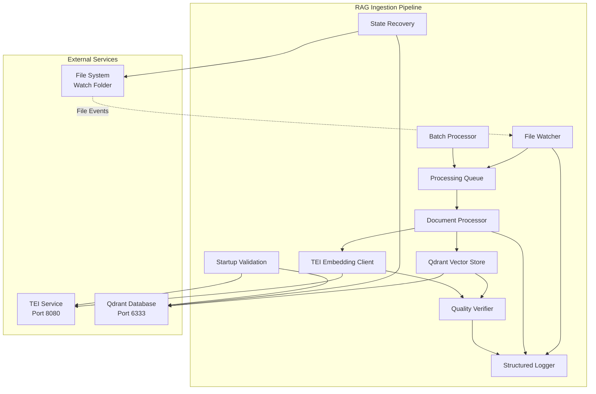
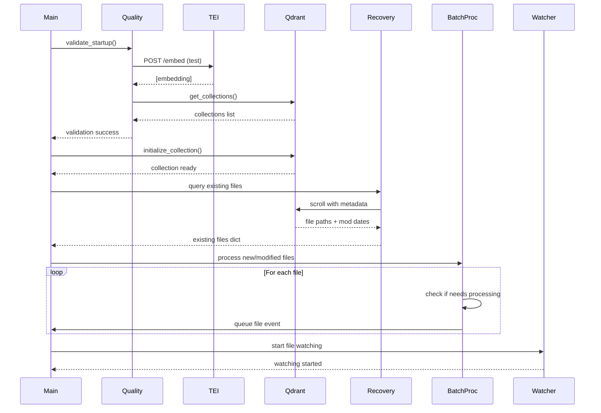
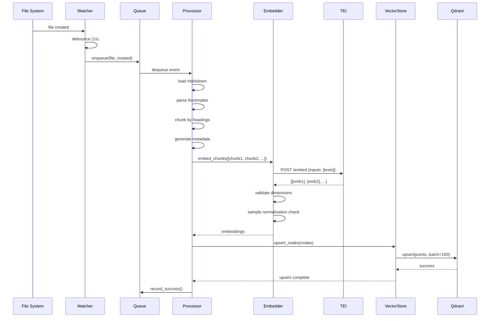
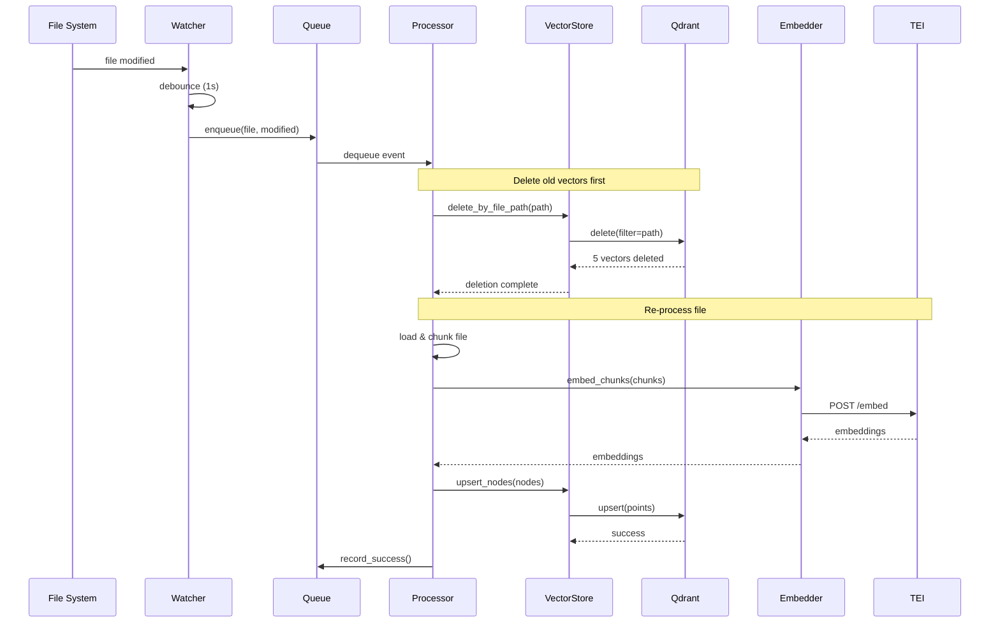
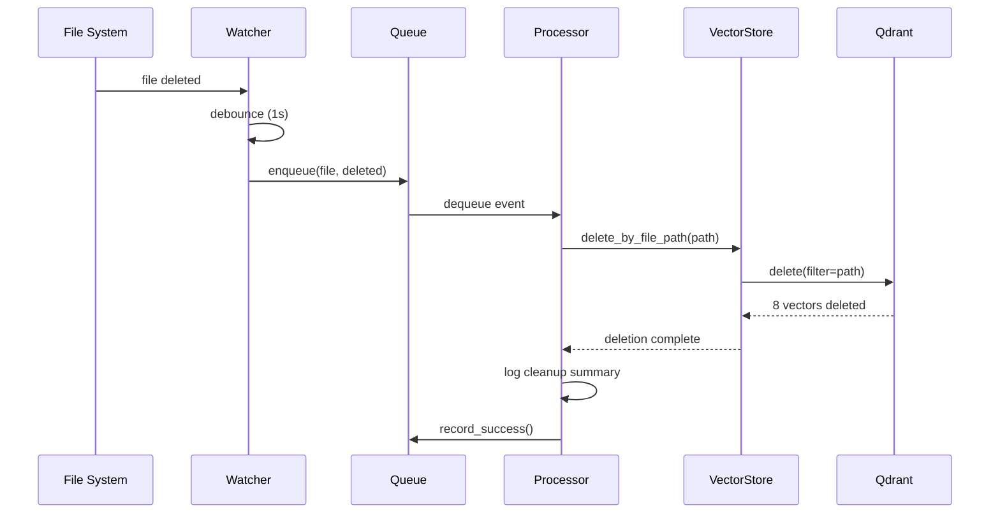
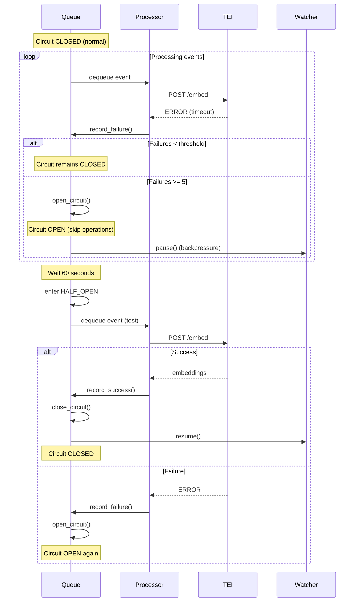

# Design: RAG Ingestion Pipeline

## Overview

The RAG Ingestion Pipeline is an automated document processing system that monitors a folder for markdown files, generates 1024-dimensional embeddings using HuggingFace TEI with Qwen3-Embedding-0.6B, and stores vectors in Qdrant with comprehensive metadata. The system uses LlamaIndex for document orchestration, implements markdown-aware chunking with heading-based splitting, and provides robust error handling with circuit breaker patterns for service failures. The architecture supports batch processing of existing files on startup, real-time file monitoring with debouncing, and intelligent state recovery after restarts.

**Key Design Principles**:
- **Async-first**: Non-blocking processing with asyncio for scalability
- **Idempotent operations**: Deterministic point IDs enable safe re-ingestion
- **Fail-safe**: Circuit breakers, retry logic, and comprehensive error logging
- **Observable**: Structured logging with progress tracking and quality metrics

## Architecture



## Components

### 2.1 Configuration Module (config.py)

**Purpose**: Centralized configuration management with validation and environment-specific defaults.

**Responsibilities**:
- Load and validate environment variables
- Provide type-safe configuration access
- Set reasonable defaults for optional parameters
- Validate configuration constraints on startup

**Interfaces**:

```python
from pydantic_settings import BaseSettings
from pydantic import Field, field_validator, ConfigDict
from pathlib import Path
from typing import Optional


class IngestionConfig(BaseSettings):
    """Configuration for RAG ingestion pipeline with validation."""

    model_config = ConfigDict(env_file=".env", env_file_encoding="utf-8")

    # Required settings (no defaults)
    watch_folder: Path = Field(
        description="Path to folder containing markdown files to monitor"
    )

    # Service endpoints
    tei_endpoint: str = Field(
        default="http://crawl4r-embeddings:80",
        description="TEI service endpoint URL"
    )
    qdrant_url: str = Field(
        default="http://crawl4r-vectors:6333",
        description="Qdrant service URL"
    )
    collection_name: str = Field(
        default="llama",
        description="Qdrant collection name for vector storage"
    )

    # Chunking parameters
    chunk_size_tokens: int = Field(
        default=512,
        ge=128,
        le=2048,
        description="Target chunk size in tokens"
    )
    chunk_overlap_percent: int = Field(
        default=15,
        ge=0,
        le=50,
        description="Percentage overlap between consecutive chunks"
    )

    # Performance parameters
    max_concurrent_docs: int = Field(
        default=10,
        ge=1,
        le=50,
        description="Maximum documents to process concurrently"
    )
    queue_max_size: int = Field(
        default=1000,
        ge=100,
        le=10000,
        description="Maximum queue size before backpressure"
    )
    tei_batch_size: int = Field(
        default=32,
        ge=1,
        le=64,
        description="Maximum texts per TEI batch request"
    )

    # Circuit breaker settings
    circuit_breaker_threshold: int = Field(
        default=5,
        ge=3,
        le=10,
        description="Consecutive failures before opening circuit"
    )
    circuit_breaker_timeout: int = Field(
        default=60,
        ge=30,
        le=300,
        description="Seconds to wait before retrying after circuit opens"
    )

    # Retry settings
    max_retries: int = Field(
        default=3,
        ge=1,
        le=5,
        description="Maximum retry attempts for transient failures"
    )
    retry_base_delay: float = Field(
        default=1.0,
        ge=0.5,
        le=5.0,
        description="Base delay for exponential backoff in seconds"
    )

    # Logging settings
    log_level: str = Field(
        default="INFO",
        description="Logging level (DEBUG, INFO, WARNING, ERROR)"
    )
    log_file: Path = Field(
        default=Path("rag_ingestion.log"),
        description="Path to log file"
    )
    log_max_bytes: int = Field(
        default=100 * 1024 * 1024,  # 100MB
        description="Maximum log file size before rotation"
    )
    log_backup_count: int = Field(
        default=5,
        description="Number of rotated log files to keep"
    )
    failed_docs_log: Path = Field(
        default=Path("failed_documents.jsonl"),
        description="Path to failed documents log"
    )

    # Quality verification
    normalization_tolerance: float = Field(
        default=0.01,
        ge=0.001,
        le=0.1,
        description="Tolerance for L2 normalization check"
    )
    normalization_sample_rate: float = Field(
        default=0.05,
        ge=0.01,
        le=1.0,
        description="Percentage of embeddings to check for normalization"
    )

    # File watching settings
    debounce_seconds: float = Field(
        default=1.0,
        ge=0.5,
        le=5.0,
        description="Debounce delay for file events in seconds"
    )

    # Startup validation settings
    startup_retry_delays: list[int] = Field(
        default=[5, 10, 20],
        description="Retry delays for startup validation in seconds"
    )

    @field_validator("watch_folder")
    @classmethod
    def validate_watch_folder(cls, v: Path) -> Path:
        """Ensure watch folder exists and is a directory."""
        if not v.exists():
            raise ValueError(f"Watch folder does not exist: {v}")
        if not v.is_dir():
            raise ValueError(f"Watch folder is not a directory: {v}")
        return v.resolve()

    @property
    def chunk_overlap_tokens(self) -> int:
        """Calculate overlap in tokens from percentage."""
        return int(self.chunk_size_tokens * self.chunk_overlap_percent / 100)

    @property
    def queue_resume_threshold(self) -> int:
        """Queue size at which to resume file watching (80% of max)."""
        return int(self.queue_max_size * 0.8)

    def log_config(self, logger) -> None:
        """Log configuration values (redact sensitive info)."""
        logger.info("Configuration loaded:")
        logger.info(f"  Watch folder: {self.watch_folder}")
        logger.info(f"  TEI endpoint: {self.tei_endpoint}")
        logger.info(f"  Qdrant URL: {self.qdrant_url}")
        logger.info(f"  Collection: {self.collection_name}")
        logger.info(f"  Chunk size: {self.chunk_size_tokens} tokens")
        logger.info(f"  Chunk overlap: {self.chunk_overlap_percent}% ({self.chunk_overlap_tokens} tokens)")
        logger.info(f"  Max concurrent docs: {self.max_concurrent_docs}")
        logger.info(f"  Queue max size: {self.queue_max_size}")
        logger.info(f"  TEI batch size: {self.tei_batch_size}")
```

**Example Configuration Files**:

`.env.dev.example`:
```bash
# Development environment configuration (RTX 3050)
WATCH_FOLDER=/data/markdown_docs
TEI_ENDPOINT=http://crawl4r-embeddings:80
QDRANT_URL=http://crawl4r-vectors:6333
COLLECTION_NAME=crawl4r

# Conservative settings for development
MAX_CONCURRENT_DOCS=8
TEI_BATCH_SIZE=20
QUEUE_MAX_SIZE=500

# Chunking
CHUNK_SIZE_TOKENS=512
CHUNK_OVERLAP_PERCENT=15

# Logging
LOG_LEVEL=DEBUG
LOG_FILE=./logs/rag_ingestion.log
FAILED_DOCS_LOG=./logs/failed_documents.jsonl
```

`.env.prod.example`:
```bash
# Production environment configuration (RTX 4070)
WATCH_FOLDER=/data/markdown_docs
TEI_ENDPOINT=http://crawl4r-embeddings:80
QDRANT_URL=http://crawl4r-vectors:6333
COLLECTION_NAME=crawl4r

# Optimized settings for production
MAX_CONCURRENT_DOCS=15
TEI_BATCH_SIZE=40
QUEUE_MAX_SIZE=1000

# Chunking
CHUNK_SIZE_TOKENS=512
CHUNK_OVERLAP_PERCENT=15

# Logging
LOG_LEVEL=INFO
LOG_FILE=/var/log/rag_ingestion/rag_ingestion.log
FAILED_DOCS_LOG=/var/log/rag_ingestion/failed_documents.jsonl
```

---

### 2.2 File Watcher Module (watcher.py)

**Purpose**: Monitor file system for markdown file changes with debouncing and exclusion filtering.

**Responsibilities**:
- Detect file create/modify/delete events
- Debounce rapid-fire events from editors
- Filter excluded directories and non-markdown files
- Route events to processing queue
- Support backpressure pausing

**Interfaces**:

```python
from watchdog.observers import Observer
from watchdog.events import PatternMatchingEventHandler
from threading import Timer
from collections import defaultdict
from pathlib import Path
from typing import Callable
import asyncio
import logging


class DebouncedMarkdownHandler(PatternMatchingEventHandler):
    """File event handler with debouncing for markdown files."""

    patterns = ["*.md"]
    ignore_patterns = [
        "*/.git/*",
        "*/.*",  # All hidden directories
        "*/__pycache__/*",
        "*/node_modules/*",
        "*/venv/*",
        "*/dist/*",
        "*/build/*",
    ]
    ignore_directories = False  # We want to handle directory patterns explicitly
    case_sensitive = True

    def __init__(
        self,
        callback: Callable[[str, str], None],
        debounce_seconds: float = 1.0,
        logger: logging.Logger = None
    ):
        super().__init__()
        self.callback = callback
        self.debounce_seconds = debounce_seconds
        self.timers: dict[str, Timer] = defaultdict(lambda: None)
        self.logger = logger or logging.getLogger(__name__)

    def on_created(self, event):
        """Handle file creation events."""
        if event.is_directory:
            return
        self._schedule_callback(event.src_path, "created")

    def on_modified(self, event):
        """Handle file modification events."""
        if event.is_directory:
            return
        self._schedule_callback(event.src_path, "modified")

    def on_deleted(self, event):
        """Handle file deletion events."""
        if event.is_directory:
            return
        self._schedule_callback(event.src_path, "deleted")

    def _schedule_callback(self, file_path: str, event_type: str):
        """Schedule callback with debouncing."""
        # Cancel existing timer for this file
        if self.timers[file_path] is not None:
            self.timers[file_path].cancel()
            self.logger.debug(f"Cancelled previous timer for {file_path}")

        # Schedule new timer
        self.timers[file_path] = Timer(
            self.debounce_seconds,
            self._handle_event,
            args=[file_path, event_type]
        )
        self.timers[file_path].start()
        self.logger.debug(
            f"Scheduled {event_type} event for {file_path} "
            f"(debounce {self.debounce_seconds}s)"
        )

    def _handle_event(self, file_path: str, event_type: str):
        """Execute callback after debounce period."""
        try:
            self.callback(file_path, event_type)
            self.logger.debug(f"Processed {event_type} event for {file_path}")
        finally:
            # Clean up timer reference
            if file_path in self.timers:
                del self.timers[file_path]


class FileWatcher:
    """File system watcher with backpressure support."""

    def __init__(
        self,
        watch_folder: Path,
        event_callback: Callable[[str, str], None],
        debounce_seconds: float = 1.0,
        logger: logging.Logger = None
    ):
        self.watch_folder = watch_folder
        self.event_callback = event_callback
        self.debounce_seconds = debounce_seconds
        self.logger = logger or logging.getLogger(__name__)

        self.handler = DebouncedMarkdownHandler(
            callback=event_callback,
            debounce_seconds=debounce_seconds,
            logger=self.logger
        )
        self.observer = Observer()
        self.is_paused = False

    def start(self):
        """Start watching the folder."""
        self.observer.schedule(
            self.handler,
            str(self.watch_folder),
            recursive=True
        )
        self.observer.start()
        self.logger.info(f"File watcher started on {self.watch_folder}")

    def stop(self):
        """Stop watching the folder."""
        self.observer.stop()
        self.observer.join(timeout=5.0)
        self.logger.info("File watcher stopped")

    def pause(self):
        """Pause file watching (backpressure)."""
        if not self.is_paused:
            self.observer.unschedule_all()
            self.is_paused = True
            self.logger.warning("File watcher PAUSED due to backpressure")

    def resume(self):
        """Resume file watching after backpressure."""
        if self.is_paused:
            self.observer.schedule(
                self.handler,
                str(self.watch_folder),
                recursive=True
            )
            self.is_paused = False
            self.logger.info("File watcher RESUMED")
```

---

### 2.3 Document Processor (processor.py)

**Purpose**: Orchestrate document loading, chunking, embedding, and storage with metadata generation.

**Responsibilities**:
- Load markdown documents with frontmatter parsing
- Generate chunks using MarkdownNodeParser
- Build section paths from heading hierarchy
- Extract metadata (file paths, modification dates, tags)
- Coordinate embedding and storage operations

**Interfaces**:

```python
from llama_index.core import Document
from llama_index.core.node_parser import MarkdownNodeParser
from llama_index.core.schema import TextNode
from pathlib import Path
from typing import Optional
from datetime import datetime
import hashlib
import uuid
import yaml
import logging


class DocumentProcessor:
    """Process markdown documents into chunks with metadata."""

    def __init__(
        self,
        watch_folder: Path,
        chunk_size: int = 512,
        chunk_overlap: int = 77,
        logger: logging.Logger = None
    ):
        self.watch_folder = watch_folder
        self.chunk_size = chunk_size
        self.chunk_overlap = chunk_overlap
        self.logger = logger or logging.getLogger(__name__)

        self.parser = MarkdownNodeParser(
            chunk_size=chunk_size,
            chunk_overlap=chunk_overlap,
            separator=" "
        )

    async def process_file(
        self,
        file_path: Path,
        event_type: str = "created"
    ) -> list[TextNode]:
        """
        Process a markdown file into chunks with metadata.

        Args:
            file_path: Path to markdown file
            event_type: Type of event (created, modified, deleted)

        Returns:
            List of TextNode objects with embeddings and metadata

        Raises:
            FileNotFoundError: If file doesn't exist
            ValueError: If file is not markdown or cannot be processed
        """
        self.logger.info(f"Processing {event_type} file: {file_path}")

        # Validate file
        if not file_path.exists():
            raise FileNotFoundError(f"File not found: {file_path}")

        if not file_path.suffix == ".md":
            raise ValueError(f"Not a markdown file: {file_path}")

        # Check file size (default max 10MB)
        max_size = 10 * 1024 * 1024
        if file_path.stat().st_size > max_size:
            raise ValueError(f"File too large (>{max_size} bytes): {file_path}")

        # Read file content
        try:
            with open(file_path, "r", encoding="utf-8") as f:
                content = f.read()
        except UnicodeDecodeError:
            raise ValueError(f"File is not valid UTF-8: {file_path}")

        # Extract frontmatter and tags
        tags = self._extract_frontmatter_tags(content)

        # Create LlamaIndex document
        doc = Document(
            text=content,
            metadata={
                "file_path": str(file_path),
                "filename": file_path.name,
            }
        )

        # Parse into chunks
        nodes = self.parser.get_nodes_from_documents([doc])

        # Enhance metadata for each chunk
        file_path_relative = self._get_relative_path(file_path)
        file_path_absolute = str(file_path.resolve())
        modification_date = datetime.fromtimestamp(
            file_path.stat().st_mtime
        ).isoformat()

        for idx, node in enumerate(nodes):
            # Generate deterministic point ID
            point_id = self._generate_point_id(file_path_relative, idx)

            # Generate content hash for verification
            content_hash = hashlib.sha256(
                node.get_content().encode()
            ).hexdigest()

            # Build section path from heading hierarchy
            section_path = self._build_section_path(node, file_path.name)
            heading_level = self._extract_heading_level(node)

            # Set comprehensive metadata
            node.id_ = point_id
            node.metadata.update({
                "file_path_relative": file_path_relative,
                "file_path_absolute": file_path_absolute,
                "filename": file_path.name,
                "modification_date": modification_date,
                "chunk_index": idx,
                "chunk_text": node.get_content(),
                "section_path": section_path,
                "heading_level": heading_level,
                "content_hash": content_hash,
                "tags": tags,
            })

            self.logger.debug(
                f"Chunk {idx}: {len(node.get_content())} chars, "
                f"section='{section_path}', level={heading_level}"
            )

        self.logger.info(
            f"Processed {file_path.name}: {len(nodes)} chunks, "
            f"{sum(len(n.get_content()) for n in nodes)} total chars"
        )

        return nodes

    def _extract_frontmatter_tags(self, content: str) -> Optional[list[str]]:
        """Extract tags from YAML frontmatter, skip invalid gracefully."""
        if not content.startswith("---"):
            return None

        try:
            # Find frontmatter boundaries
            parts = content.split("---", 2)
            if len(parts) < 3:
                return None

            frontmatter = parts[1].strip()
            data = yaml.safe_load(frontmatter)

            if not isinstance(data, dict):
                return None

            tags = data.get("tags")
            if tags and isinstance(tags, list):
                return [str(tag) for tag in tags]

        except yaml.YAMLError as e:
            self.logger.warning(f"Invalid YAML frontmatter: {e}")

        return None

    def _get_relative_path(self, file_path: Path) -> str:
        """Get path relative to watch folder."""
        try:
            return str(file_path.relative_to(self.watch_folder))
        except ValueError:
            # File is outside watch folder
            return str(file_path)

    def _generate_point_id(self, file_path_relative: str, chunk_index: int) -> str:
        """
        Generate deterministic UUID from file path and chunk index.

        Uses SHA256 hash truncated to 128 bits (first 16 bytes).
        """
        content = f"{file_path_relative}:{chunk_index}"
        hash_bytes = hashlib.sha256(content.encode()).digest()[:16]
        return str(uuid.UUID(bytes=hash_bytes))

    def _build_section_path(self, node: TextNode, filename: str) -> str:
        """
        Build section path from heading hierarchy.

        Examples:
            "Installation > Prerequisites"
            "README.md" (for documents without headings)
        """
        # Check if node has heading metadata from parser
        if hasattr(node, "metadata") and "header_path" in node.metadata:
            return node.metadata["header_path"]

        # Try to extract from content
        content = node.get_content()
        lines = content.split("\n")

        for line in lines:
            if line.startswith("#"):
                heading = line.lstrip("#").strip()
                return heading

        # No headings found, use filename
        return filename

    def _extract_heading_level(self, node: TextNode) -> int:
        """
        Extract heading level (0-6) from node.

        Returns 0 if no heading found.
        """
        content = node.get_content()
        lines = content.split("\n")

        for line in lines:
            if line.startswith("#"):
                level = len(line) - len(line.lstrip("#"))
                return min(level, 6)

        return 0
```

---

### 2.4 TEI Embedding Client (embeddings.py)

**Purpose**: Custom LlamaIndex BaseEmbedding class integrating with TEI /embed endpoint.

**Responsibilities**:
- Implement LlamaIndex embedding interface
- Batch embedding requests (max 32 texts)
- Validate 1024-dimensional responses
- Retry with exponential backoff on failures
- Sample-based L2 normalization verification

**Interfaces**:

```python
from llama_index.core.embeddings import BaseEmbedding
from llama_index.core.bridge.pydantic import PrivateAttr
import requests
import numpy as np
from typing import List
import logging
import time
import random


class TEIEmbedding(BaseEmbedding):
    """Custom embedding class for TEI integration."""

    _endpoint_url: str = PrivateAttr()
    _dimensions: int = PrivateAttr()
    _max_retries: int = PrivateAttr()
    _retry_base_delay: float = PrivateAttr()
    _normalization_tolerance: float = PrivateAttr()
    _normalization_sample_rate: float = PrivateAttr()
    _session: requests.Session = PrivateAttr()
    _logger: logging.Logger = PrivateAttr()

    def __init__(
        self,
        endpoint_url: str,
        dimensions: int = 1024,
        max_retries: int = 3,
        retry_base_delay: float = 1.0,
        normalization_tolerance: float = 0.01,
        normalization_sample_rate: float = 0.05,
        timeout: float = 30.0,
        **kwargs
    ):
        super().__init__(**kwargs)
        self._endpoint_url = endpoint_url
        self._dimensions = dimensions
        self._max_retries = max_retries
        self._retry_base_delay = retry_base_delay
        self._normalization_tolerance = normalization_tolerance
        self._normalization_sample_rate = normalization_sample_rate

        # Configure HTTP session with connection pooling
        self._session = requests.Session()
        adapter = requests.adapters.HTTPAdapter(
            pool_connections=10,
            pool_maxsize=20,
            max_retries=0  # We handle retries manually
        )
        self._session.mount("http://", adapter)
        self._session.mount("https://", adapter)
        self._session.timeout = timeout

        self._logger = logging.getLogger(__name__)

    def _get_text_embedding(self, text: str) -> List[float]:
        """Get embedding for a single text."""
        return self._get_text_embeddings([text])[0]

    def _get_text_embeddings(self, texts: List[str]) -> List[List[float]]:
        """
        Get embeddings for multiple texts with retry logic.

        Args:
            texts: List of text strings to embed

        Returns:
            List of 1024-dimensional embedding vectors

        Raises:
            requests.RequestException: After max retries exhausted
            ValueError: If response dimensions don't match expected
        """
        for attempt in range(self._max_retries):
            try:
                # Make request to TEI /embed endpoint
                response = self._session.post(
                    f"{self._endpoint_url}/embed",
                    json={"inputs": texts},
                    timeout=self._session.timeout
                )
                response.raise_for_status()

                # Parse response
                embeddings = response.json()

                # Validate response format
                if not isinstance(embeddings, list):
                    raise ValueError(
                        f"Expected list response, got {type(embeddings)}"
                    )

                if len(embeddings) != len(texts):
                    raise ValueError(
                        f"Expected {len(texts)} embeddings, got {len(embeddings)}"
                    )

                # Validate dimensions for all embeddings
                for idx, embedding in enumerate(embeddings):
                    if len(embedding) != self._dimensions:
                        raise ValueError(
                            f"Expected {self._dimensions} dimensions, "
                            f"got {len(embedding)} for text {idx}"
                        )

                # Sample-based normalization check
                if random.random() < self._normalization_sample_rate:
                    self._check_normalization(embeddings[0])

                self._logger.debug(
                    f"Generated {len(embeddings)} embeddings "
                    f"({self._dimensions} dims each)"
                )

                return embeddings

            except requests.RequestException as e:
                delay = self._retry_base_delay * (2 ** attempt)

                if attempt < self._max_retries - 1:
                    self._logger.warning(
                        f"TEI request failed (attempt {attempt + 1}/"
                        f"{self._max_retries}): {e}. Retrying in {delay}s"
                    )
                    time.sleep(delay)
                else:
                    self._logger.error(
                        f"TEI request failed after {self._max_retries} attempts: {e}"
                    )
                    raise

        # Should never reach here due to raise in loop
        raise RuntimeError("Unexpected exit from retry loop")

    async def _aget_text_embedding(self, text: str) -> List[float]:
        """Async version of _get_text_embedding."""
        # For now, delegate to sync version
        # TODO: Implement with aiohttp for true async
        return self._get_text_embedding(text)

    async def _aget_text_embeddings(self, texts: List[str]) -> List[List[float]]:
        """Async version of _get_text_embeddings."""
        # For now, delegate to sync version
        # TODO: Implement with aiohttp for true async
        return self._get_text_embeddings(texts)

    def _check_normalization(self, embedding: List[float]) -> None:
        """
        Check if embedding is L2-normalized (unit vector).

        Qwen3 embeddings are L2-normalized, so norm should be ~1.0.
        """
        norm = np.linalg.norm(embedding)

        if abs(norm - 1.0) > self._normalization_tolerance:
            self._logger.warning(
                f"Embedding L2 norm is {norm:.4f}, expected ~1.0 "
                f"(tolerance ±{self._normalization_tolerance})"
            )
        else:
            self._logger.debug(f"Embedding L2 norm check passed: {norm:.4f}")

    @classmethod
    def class_name(cls) -> str:
        """Return class name for LlamaIndex."""
        return "TEIEmbedding"
```

---

### 2.5 Qdrant Vector Store (vector_store.py)

**Purpose**: Manage vector storage lifecycle with bulk operations and payload indexing.

**Responsibilities**:
- Initialize Qdrant collection with proper configuration
- Bulk upsert operations for efficiency
- Delete vectors by file path filter
- Create payload indexes for fast filtering
- Provide state recovery queries

**Interfaces**:

```python
from qdrant_client import QdrantClient
from qdrant_client.http.models import (
    Distance,
    VectorParams,
    PayloadSchemaType,
    PointStruct,
    Filter,
    FieldCondition,
    MatchValue,
)
from llama_index.core.schema import TextNode
from typing import List, Optional
import logging


class QdrantVectorManager:
    """Manage Qdrant vector storage with lifecycle operations."""

    def __init__(
        self,
        url: str,
        collection_name: str,
        vector_size: int = 1024,
        logger: logging.Logger = None
    ):
        self.client = QdrantClient(url=url)
        self.collection_name = collection_name
        self.vector_size = vector_size
        self.logger = logger or logging.getLogger(__name__)

    async def initialize_collection(self) -> None:
        """
        Initialize Qdrant collection with proper configuration.

        Creates collection if it doesn't exist, and ensures payload indexes.
        """
        # Check if collection exists
        collections = self.client.get_collections().collections
        collection_exists = any(
            c.name == self.collection_name for c in collections
        )

        if not collection_exists:
            self.logger.info(
                f"Creating collection '{self.collection_name}' "
                f"with {self.vector_size}-dimensional vectors"
            )

            self.client.create_collection(
                collection_name=self.collection_name,
                vectors_config=VectorParams(
                    size=self.vector_size,
                    distance=Distance.COSINE
                )
            )
        else:
            # Verify configuration
            info = self.client.get_collection(self.collection_name)
            actual_size = info.config.params.vectors.size

            if actual_size != self.vector_size:
                raise ValueError(
                    f"Collection '{self.collection_name}' has {actual_size} "
                    f"dimensions, expected {self.vector_size}"
                )

            self.logger.info(
                f"Using existing collection '{self.collection_name}'"
            )

        # Create payload indexes for filtering
        await self._create_payload_indexes()

    async def _create_payload_indexes(self) -> None:
        """Create indexes on metadata fields for fast filtering."""
        indexes = [
            ("file_path_relative", PayloadSchemaType.KEYWORD),
            ("filename", PayloadSchemaType.KEYWORD),
            ("modification_date", PayloadSchemaType.DATETIME),
            ("tags", PayloadSchemaType.KEYWORD),
        ]

        for field_name, field_type in indexes:
            try:
                self.client.create_payload_index(
                    collection_name=self.collection_name,
                    field_name=field_name,
                    field_schema=field_type,
                    wait=True
                )
                self.logger.debug(
                    f"Created payload index: {field_name} ({field_type})"
                )
            except Exception as e:
                # Index may already exist
                self.logger.debug(
                    f"Payload index {field_name} already exists or failed: {e}"
                )

    async def upsert_nodes(self, nodes: List[TextNode]) -> None:
        """
        Bulk upsert nodes with embeddings and metadata.

        Args:
            nodes: List of TextNode objects with embeddings and metadata
        """
        if not nodes:
            self.logger.warning("No nodes to upsert")
            return

        # Convert nodes to Qdrant points
        points = []
        for node in nodes:
            if not hasattr(node, "embedding") or node.embedding is None:
                raise ValueError(f"Node {node.id_} has no embedding")

            point = PointStruct(
                id=node.id_,
                vector=node.embedding,
                payload=node.metadata
            )
            points.append(point)

        # Batch upsert (100 points per request)
        batch_size = 100
        for i in range(0, len(points), batch_size):
            batch = points[i:i + batch_size]

            try:
                self.client.upsert(
                    collection_name=self.collection_name,
                    points=batch,
                    wait=True
                )
                self.logger.debug(
                    f"Upserted batch {i // batch_size + 1}: {len(batch)} points"
                )
            except Exception as e:
                self.logger.error(f"Failed to upsert batch: {e}")
                raise

        self.logger.info(
            f"Upserted {len(points)} vectors to collection '{self.collection_name}'"
        )

    async def delete_by_file_path(self, file_path_relative: str) -> int:
        """
        Delete all vectors associated with a file.

        Args:
            file_path_relative: Relative path to file

        Returns:
            Count of vectors deleted
        """
        try:
            # Delete points matching file path
            result = self.client.delete(
                collection_name=self.collection_name,
                points_selector=Filter(
                    must=[
                        FieldCondition(
                            key="file_path_relative",
                            match=MatchValue(value=file_path_relative)
                        )
                    ]
                ),
                wait=True
            )

            count = result.operation_id if result else 0
            self.logger.info(
                f"Deleted {count} vectors for file: {file_path_relative}"
            )

            return count

        except Exception as e:
            self.logger.error(
                f"Failed to delete vectors for {file_path_relative}: {e}"
            )
            raise

    async def get_existing_files(self) -> dict[str, str]:
        """
        Get all files in collection with their modification dates.

        Returns:
            Dictionary mapping file_path_relative -> modification_date
        """
        files = {}

        try:
            # Scroll through all points to collect unique files
            offset = None
            limit = 100

            while True:
                records, next_offset = self.client.scroll(
                    collection_name=self.collection_name,
                    limit=limit,
                    offset=offset,
                    with_payload=["file_path_relative", "modification_date"],
                    with_vectors=False
                )

                for record in records:
                    file_path = record.payload.get("file_path_relative")
                    mod_date = record.payload.get("modification_date")

                    if file_path and mod_date:
                        # Keep most recent modification date
                        if file_path not in files or mod_date > files[file_path]:
                            files[file_path] = mod_date

                if next_offset is None:
                    break

                offset = next_offset

            self.logger.info(
                f"Found {len(files)} unique files in collection"
            )

            return files

        except Exception as e:
            self.logger.error(f"Failed to query existing files: {e}")
            raise

    async def get_collection_stats(self) -> dict:
        """Get collection statistics."""
        try:
            info = self.client.get_collection(self.collection_name)

            stats = {
                "vectors_count": info.vectors_count,
                "points_count": info.points_count,
                "indexed_vectors_count": info.indexed_vectors_count,
                "segments_count": len(info.segments) if info.segments else 0,
            }

            self.logger.info(
                f"Collection stats: {stats['points_count']} points, "
                f"{stats['vectors_count']} vectors"
            )

            return stats

        except Exception as e:
            self.logger.error(f"Failed to get collection stats: {e}")
            raise
```

---

### 2.6 Queue Manager (queue_manager.py)

**Purpose**: Async queue with backpressure and circuit breaker for resilient processing.

**Responsibilities**:
- Manage async processing queue with size limits
- Implement backpressure (pause watcher at threshold)
- Circuit breaker pattern for service failures
- Event prioritization (deletion > modification > creation)
- Progress tracking and logging

**Interfaces**:

```python
import asyncio
from asyncio import Queue
from dataclasses import dataclass
from enum import Enum
from typing import Callable, Optional
from pathlib import Path
import logging
import time


class EventType(Enum):
    """File event types with priority ordering."""
    DELETED = 1      # Highest priority
    MODIFIED = 2
    CREATED = 3      # Lowest priority


@dataclass
class FileEvent:
    """File system event with metadata."""
    file_path: Path
    event_type: EventType
    timestamp: float

    def __lt__(self, other):
        """Priority ordering for queue."""
        # Higher priority (lower enum value) first
        if self.event_type.value != other.event_type.value:
            return self.event_type.value < other.event_type.value
        # Then by timestamp (older first)
        return self.timestamp < other.timestamp


class CircuitState(Enum):
    """Circuit breaker states."""
    CLOSED = "closed"      # Normal operation
    OPEN = "open"          # Service failing, skip operations
    HALF_OPEN = "half_open"  # Testing if service recovered


class QueueManager:
    """Async queue manager with backpressure and circuit breaker."""

    def __init__(
        self,
        max_size: int,
        resume_threshold: int,
        circuit_breaker_threshold: int = 5,
        circuit_breaker_timeout: int = 60,
        logger: logging.Logger = None
    ):
        self.queue: Queue[FileEvent] = Queue(maxsize=max_size)
        self.max_size = max_size
        self.resume_threshold = resume_threshold
        self.circuit_breaker_threshold = circuit_breaker_threshold
        self.circuit_breaker_timeout = circuit_breaker_timeout
        self.logger = logger or logging.getLogger(__name__)

        # Backpressure state
        self.is_paused = False
        self.pause_callback: Optional[Callable] = None
        self.resume_callback: Optional[Callable] = None

        # Circuit breaker state
        self.circuit_state = CircuitState.CLOSED
        self.failure_count = 0
        self.circuit_opened_at: Optional[float] = None

        # Metrics
        self.processed_count = 0
        self.failed_count = 0
        self.last_log_time = time.time()

    def set_backpressure_callbacks(
        self,
        pause_callback: Callable,
        resume_callback: Callable
    ):
        """Set callbacks for backpressure control."""
        self.pause_callback = pause_callback
        self.resume_callback = resume_callback

    async def enqueue(self, file_path: Path, event_type_str: str):
        """
        Add file event to queue with backpressure handling.

        Args:
            file_path: Path to file
            event_type_str: Event type string (created, modified, deleted)
        """
        # Convert string to enum
        event_type = EventType[event_type_str.upper()]

        event = FileEvent(
            file_path=file_path,
            event_type=event_type,
            timestamp=time.time()
        )

        # Check circuit breaker
        if self.circuit_state == CircuitState.OPEN:
            if self._should_close_circuit():
                self._close_circuit()
            else:
                self.logger.warning(
                    f"Circuit OPEN, queueing event for later: {file_path}"
                )

        # Add to queue (blocking if full)
        await self.queue.put(event)

        # Check backpressure
        queue_size = self.queue.qsize()

        if queue_size >= self.max_size and not self.is_paused:
            self.logger.warning(
                f"Queue FULL ({queue_size}/{self.max_size}), "
                "activating backpressure"
            )
            self._activate_backpressure()

        elif queue_size >= int(self.max_size * 0.9):
            self.logger.warning(
                f"Queue at 90% capacity ({queue_size}/{self.max_size})"
            )

        # Periodic logging
        self._log_progress()

    async def dequeue(self) -> Optional[FileEvent]:
        """
        Get next event from queue with backpressure resume.

        Returns:
            FileEvent or None if queue is empty
        """
        try:
            event = await asyncio.wait_for(self.queue.get(), timeout=0.1)

            # Check for backpressure resume
            queue_size = self.queue.qsize()
            if self.is_paused and queue_size <= self.resume_threshold:
                self.logger.info(
                    f"Queue drained to {queue_size}/{self.max_size}, "
                    "resuming file watcher"
                )
                self._deactivate_backpressure()

            return event

        except asyncio.TimeoutError:
            return None

    def record_success(self):
        """Record successful processing."""
        self.processed_count += 1
        self.failure_count = 0  # Reset failure counter

        # Close circuit if it was half-open
        if self.circuit_state == CircuitState.HALF_OPEN:
            self._close_circuit()

    def record_failure(self):
        """Record failed processing and update circuit breaker."""
        self.failed_count += 1
        self.failure_count += 1

        if self.circuit_state == CircuitState.CLOSED:
            if self.failure_count >= self.circuit_breaker_threshold:
                self._open_circuit()

        elif self.circuit_state == CircuitState.HALF_OPEN:
            # Failed during test, re-open circuit
            self._open_circuit()

    def _activate_backpressure(self):
        """Pause file watcher due to queue overflow."""
        self.is_paused = True
        if self.pause_callback:
            self.pause_callback()

    def _deactivate_backpressure(self):
        """Resume file watcher after queue drains."""
        self.is_paused = False
        if self.resume_callback:
            self.resume_callback()

    def _open_circuit(self):
        """Open circuit breaker after repeated failures."""
        self.circuit_state = CircuitState.OPEN
        self.circuit_opened_at = time.time()
        self.logger.error(
            f"Circuit breaker OPENED after {self.failure_count} failures. "
            f"Will retry in {self.circuit_breaker_timeout}s"
        )

    def _close_circuit(self):
        """Close circuit breaker, resume normal operation."""
        self.circuit_state = CircuitState.CLOSED
        self.failure_count = 0
        self.circuit_opened_at = None
        self.logger.info("Circuit breaker CLOSED, resuming normal operation")

    def _should_close_circuit(self) -> bool:
        """Check if circuit breaker timeout has elapsed."""
        if self.circuit_opened_at is None:
            return False

        elapsed = time.time() - self.circuit_opened_at

        if elapsed >= self.circuit_breaker_timeout:
            self.circuit_state = CircuitState.HALF_OPEN
            self.logger.info(
                "Circuit breaker timeout elapsed, entering HALF_OPEN state"
            )
            return True

        return False

    def _log_progress(self):
        """Log queue metrics periodically."""
        now = time.time()
        if now - self.last_log_time >= 60:  # Log every minute
            self.logger.info(
                f"Queue metrics: {self.queue.qsize()}/{self.max_size} items, "
                f"{self.processed_count} processed, {self.failed_count} failed, "
                f"circuit={self.circuit_state.value}"
            )
            self.last_log_time = now
```

---

### 2.7 Quality Verification (quality.py)

**Purpose**: Validate TEI and Qdrant connectivity, embedding quality, and post-ingestion integrity.

**Responsibilities**:
- Startup validation with retry logic
- Dimension verification on every embedding
- Sample-based L2 normalization checks
- Post-ingestion vector count verification

**Interfaces**:

```python
import requests
from qdrant_client import QdrantClient
import numpy as np
from typing import List
import logging
import time


class QualityVerifier:
    """Quality verification for embeddings and vector storage."""

    def __init__(
        self,
        tei_endpoint: str,
        qdrant_url: str,
        collection_name: str,
        expected_dimensions: int = 1024,
        retry_delays: list[int] = None,
        logger: logging.Logger = None
    ):
        self.tei_endpoint = tei_endpoint
        self.qdrant_url = qdrant_url
        self.collection_name = collection_name
        self.expected_dimensions = expected_dimensions
        self.retry_delays = retry_delays or [5, 10, 20]
        self.logger = logger or logging.getLogger(__name__)

    async def validate_startup(self) -> bool:
        """
        Validate TEI and Qdrant connectivity on startup.

        Returns:
            True if validation successful

        Raises:
            RuntimeError: After all retries exhausted
        """
        self.logger.info("Starting startup validation...")

        # Validate TEI
        if not await self._validate_tei_with_retry():
            raise RuntimeError(
                "TEI validation failed after all retries. "
                f"Check that TEI is running at {self.tei_endpoint}"
            )

        # Validate Qdrant
        if not await self._validate_qdrant_with_retry():
            raise RuntimeError(
                "Qdrant validation failed after all retries. "
                f"Check that Qdrant is running at {self.qdrant_url}"
            )

        self.logger.info("✅ Startup validation successful")
        return True

    async def _validate_tei_with_retry(self) -> bool:
        """Validate TEI with retry logic."""
        for attempt, delay in enumerate(self.retry_delays, start=1):
            try:
                self.logger.info(
                    f"Validating TEI connection (attempt {attempt}/"
                    f"{len(self.retry_delays)})..."
                )

                # Test embedding generation
                response = requests.post(
                    f"{self.tei_endpoint}/embed",
                    json={"inputs": ["test"]},
                    timeout=10.0
                )
                response.raise_for_status()

                # Validate response
                embeddings = response.json()
                if not isinstance(embeddings, list) or len(embeddings) != 1:
                    raise ValueError(
                        f"Invalid TEI response format: {type(embeddings)}"
                    )

                # Check dimensions
                embedding = embeddings[0]
                if len(embedding) != self.expected_dimensions:
                    raise ValueError(
                        f"TEI returned {len(embedding)} dimensions, "
                        f"expected {self.expected_dimensions}"
                    )

                self.logger.info(
                    f"✅ TEI validation successful ({self.expected_dimensions} dims)"
                )
                return True

            except Exception as e:
                self.logger.warning(
                    f"TEI validation failed (attempt {attempt}/"
                    f"{len(self.retry_delays)}): {e}"
                )

                if attempt < len(self.retry_delays):
                    self.logger.info(f"Retrying in {delay} seconds...")
                    time.sleep(delay)

        return False

    async def _validate_qdrant_with_retry(self) -> bool:
        """Validate Qdrant with retry logic."""
        for attempt, delay in enumerate(self.retry_delays, start=1):
            try:
                self.logger.info(
                    f"Validating Qdrant connection (attempt {attempt}/"
                    f"{len(self.retry_delays)})..."
                )

                # Connect to Qdrant
                client = QdrantClient(url=self.qdrant_url)

                # List collections (validates connection)
                collections = client.get_collections()

                # Check if our collection exists and has correct config
                collection_exists = any(
                    c.name == self.collection_name for c in collections.collections
                )

                if collection_exists:
                    info = client.get_collection(self.collection_name)
                    actual_dims = info.config.params.vectors.size

                    if actual_dims != self.expected_dimensions:
                        raise ValueError(
                            f"Collection '{self.collection_name}' has "
                            f"{actual_dims} dimensions, expected "
                            f"{self.expected_dimensions}"
                        )

                    self.logger.info(
                        f"✅ Qdrant validation successful "
                        f"(collection exists, {actual_dims} dims)"
                    )
                else:
                    self.logger.info(
                        f"✅ Qdrant validation successful "
                        f"(will create collection '{self.collection_name}')"
                    )

                return True

            except Exception as e:
                self.logger.warning(
                    f"Qdrant validation failed (attempt {attempt}/"
                    f"{len(self.retry_delays)}): {e}"
                )

                if attempt < len(self.retry_delays):
                    self.logger.info(f"Retrying in {delay} seconds...")
                    time.sleep(delay)

        return False

    async def verify_post_ingestion(
        self,
        expected_chunks: int,
        actual_vectors: int
    ) -> bool:
        """
        Verify vector count matches expected chunk count.

        Args:
            expected_chunks: Number of chunks generated
            actual_vectors: Number of vectors in Qdrant

        Returns:
            True if counts match within tolerance
        """
        if expected_chunks == actual_vectors:
            self.logger.info(
                f"✅ Post-ingestion verification passed: "
                f"{actual_vectors} vectors stored"
            )
            return True
        else:
            self.logger.warning(
                f"⚠️ Post-ingestion mismatch: expected {expected_chunks} chunks, "
                f"found {actual_vectors} vectors in Qdrant"
            )
            return False
```

---

### 2.8 Logging Setup (logger.py)

**Purpose**: Configure structured logging with human-readable format and file rotation.

**Responsibilities**:
- Human-readable log format for development
- Rotating file handler to prevent disk exhaustion
- Component-specific loggers
- Log level configuration

**Interfaces**:

```python
import logging
from logging.handlers import RotatingFileHandler
from pathlib import Path


def setup_logging(
    log_level: str = "INFO",
    log_file: Path = None,
    max_bytes: int = 100 * 1024 * 1024,
    backup_count: int = 5
) -> logging.Logger:
    """
    Configure logging with human-readable format and rotation.

    Args:
        log_level: Logging level (DEBUG, INFO, WARNING, ERROR)
        log_file: Path to log file (None for stdout only)
        max_bytes: Maximum log file size before rotation
        backup_count: Number of rotated files to keep

    Returns:
        Root logger instance
    """
    # Create formatter
    formatter = logging.Formatter(
        fmt='%(asctime)s [%(levelname)s] %(name)s: %(message)s',
        datefmt='%Y-%m-%d %H:%M:%S'
    )

    # Configure root logger
    root_logger = logging.getLogger()
    root_logger.setLevel(log_level)

    # Remove existing handlers
    for handler in root_logger.handlers[:]:
        root_logger.removeHandler(handler)

    # Add stdout handler
    console_handler = logging.StreamHandler()
    console_handler.setFormatter(formatter)
    root_logger.addHandler(console_handler)

    # Add file handler if specified
    if log_file:
        # Ensure log directory exists
        log_file.parent.mkdir(parents=True, exist_ok=True)

        file_handler = RotatingFileHandler(
            filename=str(log_file),
            maxBytes=max_bytes,
            backupCount=backup_count,
            encoding='utf-8'
        )
        file_handler.setFormatter(formatter)
        root_logger.addHandler(file_handler)

        root_logger.info(f"Logging to file: {log_file}")

    return root_logger


def get_component_logger(component_name: str) -> logging.Logger:
    """Get logger for specific component."""
    return logging.getLogger(f"rag_ingestion.{component_name}")
```

---

## Data Flow Diagrams

### Startup Flow



### New File Event Flow



### Modification Event Flow



### Deletion Event Flow



### Circuit Breaker Flow



---

## API Signatures

### Configuration Classes

```python
class IngestionConfig(BaseSettings):
    """Configuration with validation."""
    watch_folder: Path
    tei_endpoint: str = "http://crawl4r-embeddings:80"
    qdrant_url: str = "http://crawl4r-vectors:6333"
    collection_name: str = "crawl4r"
    chunk_size_tokens: int = 512
    chunk_overlap_percent: int = 15
    max_concurrent_docs: int = 10
    queue_max_size: int = 1000
    # ... (see full definition above)
```

### TEI Embedding Class

```python
class TEIEmbedding(BaseEmbedding):
    """Custom embedding class for TEI."""

    def __init__(
        self,
        endpoint_url: str,
        dimensions: int = 1024,
        max_retries: int = 3,
        retry_base_delay: float = 1.0,
        normalization_tolerance: float = 0.01,
        normalization_sample_rate: float = 0.05,
        timeout: float = 30.0,
        **kwargs
    ) -> None: ...

    def _get_text_embedding(self, text: str) -> List[float]: ...

    def _get_text_embeddings(self, texts: List[str]) -> List[List[float]]: ...

    async def _aget_text_embedding(self, text: str) -> List[float]: ...

    async def _aget_text_embeddings(self, texts: List[str]) -> List[List[float]]: ...
```

### Queue Manager Interface

```python
class QueueManager:
    """Async queue with backpressure and circuit breaker."""

    def __init__(
        self,
        max_size: int,
        resume_threshold: int,
        circuit_breaker_threshold: int = 5,
        circuit_breaker_timeout: int = 60,
        logger: Optional[logging.Logger] = None
    ) -> None: ...

    async def enqueue(self, file_path: Path, event_type: str) -> None: ...

    async def dequeue(self) -> Optional[FileEvent]: ...

    def record_success(self) -> None: ...

    def record_failure(self) -> None: ...

    def set_backpressure_callbacks(
        self,
        pause_callback: Callable,
        resume_callback: Callable
    ) -> None: ...
```

### Document Processor Functions

```python
class DocumentProcessor:
    """Process markdown documents."""

    def __init__(
        self,
        watch_folder: Path,
        chunk_size: int = 512,
        chunk_overlap: int = 77,
        logger: Optional[logging.Logger] = None
    ) -> None: ...

    async def process_file(
        self,
        file_path: Path,
        event_type: str = "created"
    ) -> List[TextNode]: ...

    def _extract_frontmatter_tags(self, content: str) -> Optional[List[str]]: ...

    def _get_relative_path(self, file_path: Path) -> str: ...

    def _generate_point_id(self, file_path_relative: str, chunk_index: int) -> str: ...

    def _build_section_path(self, node: TextNode, filename: str) -> str: ...

    def _extract_heading_level(self, node: TextNode) -> int: ...
```

### Vector Store Manager

```python
class QdrantVectorManager:
    """Manage Qdrant vector storage."""

    def __init__(
        self,
        url: str,
        collection_name: str,
        vector_size: int = 1024,
        logger: Optional[logging.Logger] = None
    ) -> None: ...

    async def initialize_collection(self) -> None: ...

    async def upsert_nodes(self, nodes: List[TextNode]) -> None: ...

    async def delete_by_file_path(self, file_path_relative: str) -> int: ...

    async def get_existing_files(self) -> dict[str, str]: ...

    async def get_collection_stats(self) -> dict: ...
```

### Quality Verifier

```python
class QualityVerifier:
    """Quality verification for embeddings and storage."""

    def __init__(
        self,
        tei_endpoint: str,
        qdrant_url: str,
        collection_name: str,
        expected_dimensions: int = 1024,
        retry_delays: Optional[List[int]] = None,
        logger: Optional[logging.Logger] = None
    ) -> None: ...

    async def validate_startup(self) -> bool: ...

    async def verify_post_ingestion(
        self,
        expected_chunks: int,
        actual_vectors: int
    ) -> bool: ...
```

---

## Error Handling Strategy

### Retry with Exponential Backoff

**Pattern**:
```python
for attempt in range(max_retries):
    try:
        # Operation
        return result
    except TransientError as e:
        delay = base_delay * (2 ** attempt)
        if attempt < max_retries - 1:
            logger.warning(f"Attempt {attempt + 1} failed: {e}. Retry in {delay}s")
            time.sleep(delay)
        else:
            logger.error(f"All {max_retries} attempts failed")
            raise
```

**Applied To**:
- TEI embedding requests (3 retries: 1s, 2s, 4s)
- Qdrant upsert operations (3 retries: 1s, 2s, 4s)
- Startup validation (3 retries: 5s, 10s, 20s)

### Circuit Breaker Implementation

**State Machine**:
```
CLOSED (normal) --[5 failures]--> OPEN (skip operations)
OPEN --[60s timeout]--> HALF_OPEN (test recovery)
HALF_OPEN --[success]--> CLOSED
HALF_OPEN --[failure]--> OPEN
```

**Behavior**:
- **CLOSED**: Normal operation, track consecutive failures
- **OPEN**: Skip operations, queue events for later, activate backpressure
- **HALF_OPEN**: Test if service recovered with single request

**Code Pattern**:
```python
if circuit_state == CircuitState.OPEN:
    if time_since_opened >= timeout:
        circuit_state = CircuitState.HALF_OPEN
    else:
        logger.warning("Circuit OPEN, queueing event")
        return

try:
    # Operation
    record_success()  # Closes circuit if HALF_OPEN
except Exception:
    record_failure()  # Opens circuit if threshold reached
```

### Failed Document Logging

**Schema** (`failed_documents.jsonl`):
```json
{
  "file_path": "/data/docs/broken.md",
  "file_path_relative": "docs/broken.md",
  "timestamp": "2026-01-14T10:30:00Z",
  "event_type": "modified",
  "error_type": "ValueError",
  "error_message": "File is not valid UTF-8",
  "traceback": "Traceback (most recent call last)...",
  "retry_count": 3
}
```

**Writing Pattern**:
```python
import json
from datetime import datetime
import traceback

def log_failed_document(
    file_path: Path,
    event_type: str,
    error: Exception,
    retry_count: int,
    failed_docs_log: Path
):
    """Log failed document with full error details."""
    record = {
        "file_path": str(file_path.resolve()),
        "file_path_relative": str(file_path.relative_to(watch_folder)),
        "timestamp": datetime.utcnow().isoformat() + "Z",
        "event_type": event_type,
        "error_type": type(error).__name__,
        "error_message": str(error),
        "traceback": traceback.format_exc(),
        "retry_count": retry_count
    }

    with open(failed_docs_log, "a", encoding="utf-8") as f:
        f.write(json.dumps(record) + "\n")
```

### Edge Cases

| Edge Case | Detection | Handling |
|-----------|-----------|----------|
| **Binary file** | UnicodeDecodeError when reading | Skip with warning, log to failed_documents.jsonl |
| **Permission denied** | PermissionError when accessing file | Skip with warning, log error |
| **File too large** | Check file size before reading | Skip files >10MB with error message |
| **Corrupted UTF-8** | UnicodeDecodeError | Skip with warning, log to failed_documents.jsonl |
| **Invalid YAML frontmatter** | yaml.YAMLError | Skip frontmatter, continue processing with tags=null |
| **Empty file** | len(content) == 0 | Skip with debug log |
| **File deleted during processing** | FileNotFoundError | Skip gracefully, log as handled deletion |
| **Disk space exhausted** | OSError when writing logs | Fail with critical error, exit process |
| **TEI returns wrong dimensions** | Dimension validation | Raise ValueError, trigger retry |
| **Qdrant connection lost** | requests.ConnectionError | Trigger circuit breaker, queue events |

---

## File Structure

```
llama/
├── docker-compose.yml                    # TEI + Qdrant services
├── pyproject.toml                        # Python dependencies (uv)
├── .env.example                          # Configuration template
├── .env.dev.example                      # Development config
├── .env.prod.example                     # Production config
├── README.md                             # Project documentation
│
├── src/
│   └── rag_ingestion/
│       ├── __init__.py
│       ├── main.py                       # Application entry point
│       ├── config.py                     # Configuration management
│       ├── watcher.py                    # File system monitoring
│       ├── processor.py                  # Document processing
│       ├── embeddings.py                 # TEI embedding client
│       ├── vector_store.py               # Qdrant vector management
│       ├── queue_manager.py              # Async queue with backpressure
│       ├── quality.py                    # Quality verification
│       └── logger.py                     # Logging setup
│
├── tests/
│   ├── __init__.py
│   ├── conftest.py                       # Pytest fixtures
│   ├── unit/
│   │   ├── test_config.py
│   │   ├── test_processor.py
│   │   ├── test_embeddings.py
│   │   ├── test_vector_store.py
│   │   ├── test_queue_manager.py
│   │   └── test_quality.py
│   ├── integration/
│   │   ├── test_tei_integration.py
│   │   ├── test_qdrant_integration.py
│   │   └── test_end_to_end.py
│   └── fixtures/
│       ├── sample.md
│       ├── frontmatter.md
│       └── large.md
│
├── logs/                                 # Log files (gitignored)
│   ├── rag_ingestion.log
│   └── failed_documents.jsonl
│
└── data/                                 # Docker volumes (gitignored)
    ├── tei_cache/                        # TEI model weights
    └── qdrant_storage/                   # Qdrant persistent data
```

---

## Docker Compose Configuration

**docker-compose.yml**:
```yaml
services:
  embeddings:
    image: ghcr.io/huggingface/text-embeddings-inference:1.8.3
    container_name: embeddings
    ports:
      - "52000:80"
    volumes:
      - ./data/tei_cache:/data
    environment:
      - MODEL_ID=Qwen/Qwen3-Embedding-0.6B
    deploy:
      resources:
        reservations:
          devices:
            - driver: nvidia
              count: 1
              capabilities: [gpu]
    command: >
      --model-id Qwen/Qwen3-Embedding-0.6B
      --max-concurrent-requests 64
    healthcheck:
      test: ["CMD", "curl", "-f", "http://localhost:80/health"]
      interval: 30s
      timeout: 10s
      retries: 3
      start_period: 60s
    restart: unless-stopped

  vectordb:
    image: qdrant/qdrant:v1.16.2
    container_name: vectordb
    ports:
      - "52001:6333"  # REST API
      - "53334:6334"  # gRPC
    volumes:
      - ./data/qdrant_storage:/qdrant/storage
    environment:
      - QDRANT__SERVICE__HTTP_PORT=6333
      - QDRANT__SERVICE__GRPC_PORT=6334
    healthcheck:
      test: ["CMD", "curl", "-f", "http://localhost:6333/health"]
      interval: 30s
      timeout: 10s
      retries: 3
      start_period: 10s
    restart: unless-stopped

networks:
  default:
    name: llama-network
    driver: bridge
```

**Notes**:
- Using high ports (53000+) to avoid conflicts with common services
- GPU support enabled for TEI service
- Volumes for persistent storage and model caching
- Health checks with appropriate startup periods
- Restart policy for resilience

---

## Testing Strategy

### Unit Tests

**Coverage Target**: 85%+

**Test Structure**:
```python
# tests/unit/test_processor.py

import pytest
from pathlib import Path
from src.rag_ingestion.processor import DocumentProcessor

@pytest.fixture
def processor(tmp_path):
    """Create processor with temp watch folder."""
    return DocumentProcessor(
        watch_folder=tmp_path,
        chunk_size=512,
        chunk_overlap=77
    )

@pytest.fixture
def sample_markdown(tmp_path):
    """Create sample markdown file."""
    file_path = tmp_path / "sample.md"
    file_path.write_text("""---
tags: [test, sample]
---

# Introduction

This is a sample document.

## Section 1

Content here.
""")
    return file_path

def test_process_file_creates_chunks(processor, sample_markdown):
    """Test that processing creates expected chunks."""
    nodes = await processor.process_file(sample_markdown)

    assert len(nodes) > 0
    assert all(node.metadata["filename"] == "sample.md" for node in nodes)
    assert all("chunk_index" in node.metadata for node in nodes)

def test_extract_frontmatter_tags(processor):
    """Test frontmatter tag extraction."""
    content = """---
tags: [test, sample]
---
# Content
"""
    tags = processor._extract_frontmatter_tags(content)
    assert tags == ["test", "sample"]

def test_invalid_yaml_frontmatter_skipped(processor):
    """Test that invalid YAML is skipped gracefully."""
    content = """---
tags: [invalid yaml
---
# Content
"""
    tags = processor._extract_frontmatter_tags(content)
    assert tags is None
```

**Mock External Services**:
```python
# tests/unit/test_embeddings.py

import pytest
from unittest.mock import Mock, patch
from src.rag_ingestion.embeddings import TEIEmbedding

@pytest.fixture
def mock_requests():
    """Mock requests.post for TEI calls."""
    with patch("requests.post") as mock:
        mock.return_value.json.return_value = [[0.1] * 1024]
        mock.return_value.raise_for_status = Mock()
        yield mock

def test_get_embeddings_success(mock_requests):
    """Test successful embedding generation."""
    embedder = TEIEmbedding(endpoint_url="http://test:8080")

    embeddings = embedder._get_text_embeddings(["test text"])

    assert len(embeddings) == 1
    assert len(embeddings[0]) == 1024
    mock_requests.assert_called_once()

def test_get_embeddings_retry_on_failure(mock_requests):
    """Test retry logic on transient failure."""
    mock_requests.side_effect = [
        requests.RequestException("Timeout"),
        Mock(json=lambda: [[0.1] * 1024], raise_for_status=Mock())
    ]

    embedder = TEIEmbedding(endpoint_url="http://test:8080", max_retries=2)

    embeddings = embedder._get_text_embeddings(["test text"])

    assert len(embeddings) == 1
    assert mock_requests.call_count == 2
```

### Integration Tests

**Requirements**:
- TEI and Qdrant services running locally
- Test collection for isolation
- Cleanup after each test

**Test Structure**:
```python
# tests/integration/test_end_to_end.py

import pytest
from pathlib import Path
from src.rag_ingestion.config import IngestionConfig
from src.rag_ingestion.processor import DocumentProcessor
from src.rag_ingestion.embeddings import TEIEmbedding
from src.rag_ingestion.vector_store import QdrantVectorManager

@pytest.fixture
async def integration_setup(tmp_path):
    """Setup for integration tests."""
    config = IngestionConfig(
        watch_folder=tmp_path,
        tei_endpoint="http://localhost:52000",
        qdrant_url="http://localhost:52001",
        collection_name="test_collection"
    )

    processor = DocumentProcessor(
        watch_folder=config.watch_folder,
        chunk_size=config.chunk_size_tokens,
        chunk_overlap=config.chunk_overlap_tokens
    )

    embedder = TEIEmbedding(endpoint_url=config.tei_endpoint)

    vector_manager = QdrantVectorManager(
        url=config.qdrant_url,
        collection_name=config.collection_name
    )

    await vector_manager.initialize_collection()

    yield config, processor, embedder, vector_manager

    # Cleanup
    vector_manager.client.delete_collection(config.collection_name)

@pytest.mark.integration
async def test_full_ingestion_pipeline(integration_setup, tmp_path):
    """Test complete file ingestion pipeline."""
    config, processor, embedder, vector_manager = integration_setup

    # Create test markdown file
    test_file = tmp_path / "test.md"
    test_file.write_text("""# Test Document

This is a test document for integration testing.

## Section 1

Content in section 1.
""")

    # Process file
    nodes = await processor.process_file(test_file)
    assert len(nodes) > 0

    # Generate embeddings
    texts = [node.get_content() for node in nodes]
    embeddings = embedder._get_text_embeddings(texts)

    # Attach embeddings to nodes
    for node, embedding in zip(nodes, embeddings):
        node.embedding = embedding

    # Store in Qdrant
    await vector_manager.upsert_nodes(nodes)

    # Verify storage
    stats = await vector_manager.get_collection_stats()
    assert stats["points_count"] == len(nodes)

    # Test deletion
    count = await vector_manager.delete_by_file_path("test.md")
    assert count == len(nodes)
```

### Performance Benchmarks

**Benchmark Suite**:
```python
# tests/performance/test_throughput.py

import pytest
import time
from pathlib import Path

@pytest.mark.performance
async def test_batch_processing_throughput(integration_setup, tmp_path):
    """Measure documents/minute throughput."""
    config, processor, embedder, vector_manager = integration_setup

    # Create 100 test documents
    test_docs = []
    for i in range(100):
        doc_path = tmp_path / f"doc_{i}.md"
        doc_path.write_text(f"""# Document {i}

This is test document number {i}.

## Section 1

Content for document {i}.
""")
        test_docs.append(doc_path)

    # Time processing
    start_time = time.time()

    for doc_path in test_docs:
        nodes = await processor.process_file(doc_path)
        texts = [node.get_content() for node in nodes]
        embeddings = embedder._get_text_embeddings(texts)

        for node, embedding in zip(nodes, embeddings):
            node.embedding = embedding

        await vector_manager.upsert_nodes(nodes)

    elapsed = time.time() - start_time
    docs_per_minute = (100 / elapsed) * 60

    print(f"\nThroughput: {docs_per_minute:.1f} docs/min")

    # Target: 50+ docs/min on RTX 3050
    assert docs_per_minute >= 50
```

### Test Coverage Targets

| Component | Unit Tests | Integration Tests | Coverage Target |
|-----------|------------|-------------------|-----------------|
| config.py | ✅ Validation, defaults | N/A | 90%+ |
| watcher.py | ✅ Debouncing, filtering | ✅ File events | 85%+ |
| processor.py | ✅ Chunking, metadata | ✅ Full processing | 85%+ |
| embeddings.py | ✅ Retry logic, mocked | ✅ Real TEI calls | 85%+ |
| vector_store.py | ✅ Mocked Qdrant | ✅ Real Qdrant ops | 85%+ |
| queue_manager.py | ✅ Backpressure, circuit breaker | ✅ Async flow | 90%+ |
| quality.py | ✅ Validation logic | ✅ Startup checks | 85%+ |
| logger.py | ✅ Format, rotation | N/A | 80%+ |

---

## Deployment Considerations

### Hardware Requirements

**Development (RTX 3050)**:
- **GPU**: NVIDIA RTX 3050 (8GB VRAM)
- **RAM**: 16GB minimum, 32GB recommended
- **CPU**: 4+ cores
- **Disk**: 50GB free (10GB for model weights, 40GB for data)
- **Expected Throughput**: 50-100 docs/min

**Production (RTX 4070)**:
- **GPU**: NVIDIA RTX 4070 (12GB VRAM)
- **RAM**: 32GB minimum, 64GB recommended
- **CPU**: 8+ cores
- **Disk**: 200GB free (10GB for model weights, 190GB for data)
- **Expected Throughput**: 100-200 docs/min

### Environment Setup

**Prerequisites**:
```bash
# Install NVIDIA drivers and Docker with GPU support
curl -fsSL https://nvidia.github.io/libnvidia-container/gpgkey | sudo gpg --dearmor -o /usr/share/keyrings/nvidia-container-toolkit-keyring.gpg
curl -s -L https://nvidia.github.io/libnvidia-container/stable/deb/nvidia-container-toolkit.list | \
  sed 's#deb https://#deb [signed-by=/usr/share/keyrings/nvidia-container-toolkit-keyring.gpg] https://#g' | \
  sudo tee /etc/apt/sources.list.d/nvidia-container-toolkit.list
sudo apt-get update
sudo apt-get install -y nvidia-container-toolkit

# Configure Docker to use NVIDIA runtime
sudo nvidia-ctk runtime configure --runtime=docker
sudo systemctl restart docker

# Install uv (Python package manager)
curl -LsSf https://astral.sh/uv/install.sh | sh
```

**Project Setup**:
```bash
# Clone repository
git clone <repo-url> llama
cd llama

# Create virtual environment and install dependencies
uv venv
source .venv/bin/activate
uv pip install -e .

# Copy and configure environment
cp .env.dev.example .env
# Edit .env with your WATCH_FOLDER path

# Create data directories
mkdir -p data/tei_cache data/qdrant_storage logs
```

### Service Startup Sequence

1. **Start Docker services**:
```bash
docker compose up -d
```

2. **Wait for services to be healthy** (check with `docker compose ps`):
- TEI: ~60 seconds (model download on first run)
- Qdrant: ~10 seconds

3. **Run ingestion pipeline**:
```bash
python -m src.rag_ingestion.main
```

### Monitoring Recommendations

**Log Monitoring**:
```bash
# Tail main log
tail -f logs/rag_ingestion.log

# Watch failed documents
tail -f logs/failed_documents.jsonl | jq .

# Monitor queue metrics
grep "Queue metrics" logs/rag_ingestion.log | tail -n 20
```

**Service Health**:
```bash
# TEI health
curl http://localhost:52000/health

# Qdrant health
curl http://localhost:52001/health

# Qdrant collection info
curl http://localhost:52001/collections/crawl4r
```

**Performance Metrics**:
- Documents/minute throughput (logged every minute)
- Queue depth (logged every minute)
- Circuit breaker state (logged on state changes)
- Failed document count (check `failed_documents.jsonl`)
- Vector count in Qdrant (query collection periodically)

**Resource Usage**:
```bash
# Docker stats
docker stats llama-tei llama-qdrant

# GPU utilization
nvidia-smi -l 1

# Disk usage
df -h data/
```

---

## Technical Decisions

| Decision | Options Considered | Choice | Rationale |
|----------|-------------------|--------|-----------|
| **TEI Integration** | OpenAI-compatible endpoint vs Custom BaseEmbedding | Custom BaseEmbedding | User preference, full control over TEI /embed endpoint, explicit dimension handling |
| **Point ID Generation** | Auto-increment vs Hash-based UUID | SHA256→UUID truncation | Deterministic IDs enable idempotent operations, safe re-ingestion, crash recovery without state file |
| **File Path Storage** | Relative only vs Absolute only vs Both | Store both paths | Relative for portability, absolute for file operations, minimal overhead |
| **Chunk Text Storage** | Reference only vs Full text | Store full text in payload | Enables document reconstruction from vectors alone, faster query responses, accept 2-3GB for 1M vectors |
| **Debouncing Method** | Polling vs Timer-based vs Rate limiting | Timer-based with threading.Timer | Industry standard pattern, handles rapid-fire editor saves, memory efficient |
| **Queue Backpressure** | Drop events vs Pause watcher vs Block | Pause watcher at threshold | Prevents memory exhaustion, no data loss, graceful degradation |
| **Circuit Breaker** | Skip operations vs Retry immediately vs Queue | Queue events during outage | Automatic recovery when service returns, no data loss, prevents cascading failures |
| **Batch Strategy** | Fixed batches vs Per-document batching | Batch documents, embed all chunks per doc | Balances API efficiency with logical grouping, handles variable doc sizes |
| **Startup Recovery** | Separate state file vs Query Qdrant | Query Qdrant on startup | Single source of truth, no state file sync issues, reliable |
| **Memory Budget** | 2GB vs 4GB | 4GB | Realistic for 1000-item queue + LlamaIndex overhead, still conservative |
| **Normalization Check** | All embeddings vs Sampling | 5% sampling with ±0.01 tolerance | Qwen3 is L2-normalized, sampling provides quality signal without performance hit |
| **Overlap Calculation** | Percentage range vs Fixed | Fixed 15% (77 tokens) | User preference, precise control over token budgets, consistent across documents |
| **Logging Format** | JSON vs Human-readable | Human-readable for dev | Easier to read during development, can add JSON format later with env var |
| **Collection Name** | markdown_embeddings vs crawl4r | crawl4r | User preference, project name, matches docker-compose |
| **Container Hostnames** | tei/qdrant vs embeddings/vectordb | crawl4r-embeddings/crawl4r-vectors | Matches actual docker-compose configuration, project-prefixed names |
| **Python Version** | 3.9+ vs 3.10+ vs 3.11+ | 3.10+ | Qdrant client requires 3.10+, more restrictive than LlamaIndex |
| **Payload Indexing** | No indexes vs Selective indexing | Index file_path, filename, mod_date, tags | Critical for query performance at scale (10K+ files, 1M+ vectors) |

---

## Technical Decisions - Trade-offs

### SHA256→UUID Truncation

**Trade-off**: Reduces collision resistance from 256-bit to 128-bit

**Mitigation**:
- Store full SHA256 in `content_hash` metadata field
- 128-bit still provides ~10^38 unique IDs (sufficient for billions of chunks)
- Can verify integrity using content_hash

**Recommendation**: Proceed with truncation, add verification tooling later

### Full Chunk Text Storage

**Trade-off**: Increases Qdrant storage by ~2-3GB for 1M vectors

**Benefits**:
- Query responses include full context without file I/O
- Document reconstruction from vectors alone
- Survives source file deletion
- Faster retrieval

**Recommendation**: Accept storage overhead for query convenience

### Timer-Based Debouncing

**Trade-off**: Small processing delay (1 second) after last file change

**Benefits**:
- Prevents duplicate processing from rapid editor saves
- Memory efficient (one timer per active file)
- Industry standard pattern

**Recommendation**: Configurable delay (default 1s), can adjust if needed

### Custom BaseEmbedding Class

**Trade-off**: More implementation complexity than using OpenAI-compatible endpoint

**Benefits**:
- Full control over TEI /embed endpoint
- Explicit dimension validation
- Custom retry and normalization logic
- User preference honored

**Recommendation**: Implement as specified, document OpenAI-compatible alternative

---

**Last Updated**: 2026-01-14
**Status**: Ready for Implementation
**Approval Required**: Yes
