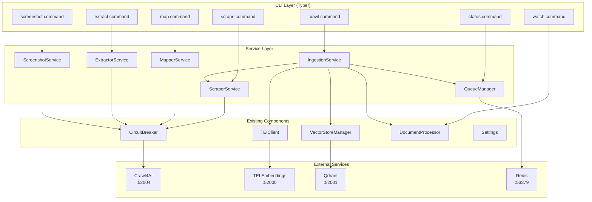
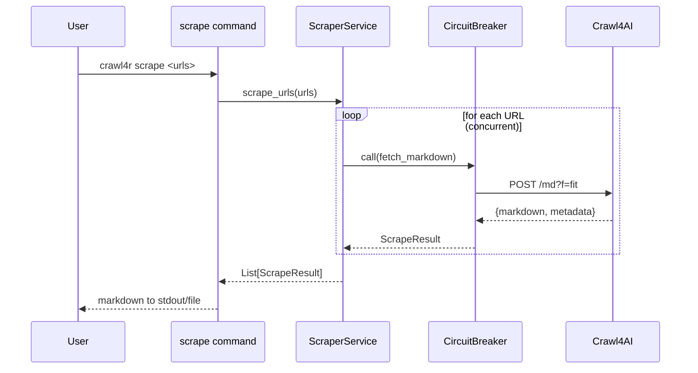
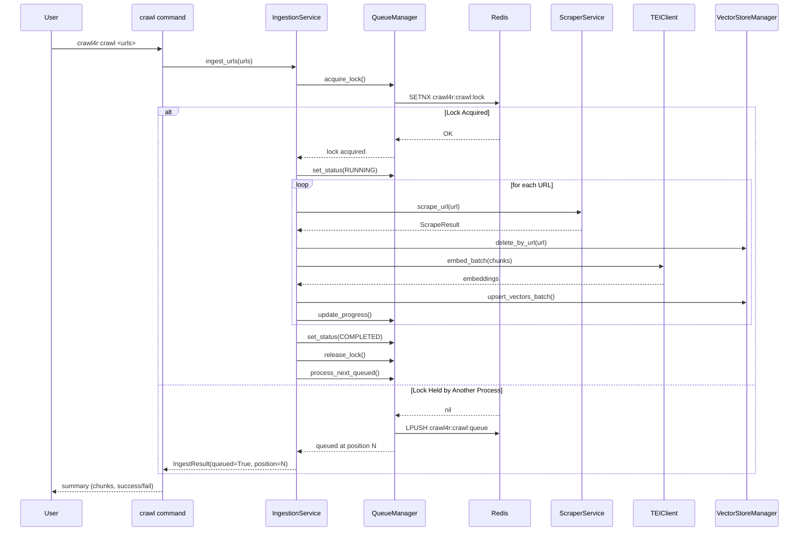
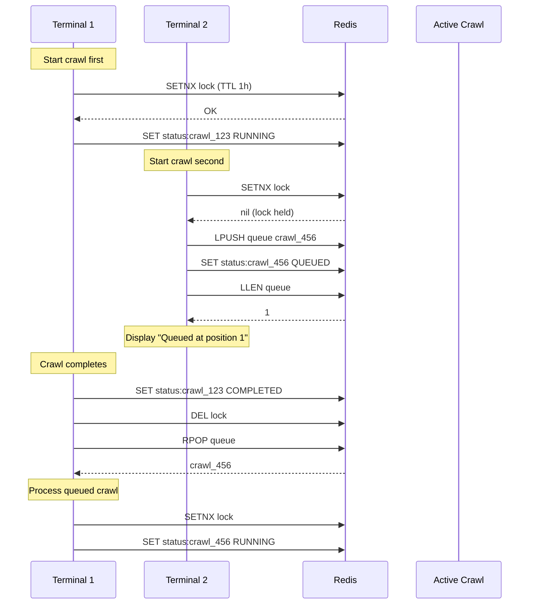

# Design: Web Crawl CLI

## Overview

This design adds web crawling capabilities to the crawl4r CLI through a service layer that cleanly separates business logic from CLI concerns. Five services (ScraperService, MapperService, ExtractorService, ScreenshotService, IngestionService) handle core operations, while thin Typer commands delegate to these services. Cross-process crawl coordination uses Redis for lock management, queue operations, and status tracking.

## Architecture



## Data Flows

### Scrape Flow



### Crawl Flow with Queue Coordination



### Queue Coordination Flow



## Component Design

### Data Structures

```python
# crawl4r/services/models.py

from dataclasses import dataclass, field
from datetime import datetime
from enum import Enum
from typing import Any


class CrawlStatus(Enum):
    """Crawl operation status values."""
    QUEUED = "QUEUED"
    RUNNING = "RUNNING"
    COMPLETED = "COMPLETED"
    FAILED = "FAILED"


@dataclass
class ScrapeResult:
    """Result of scraping a single URL.

    Attributes:
        url: Source URL that was scraped
        success: Whether scraping completed successfully
        markdown: Extracted markdown content (empty on failure)
        title: Page title from metadata
        description: Page description from metadata
        status_code: HTTP status code (0 on network error)
        crawl_timestamp: ISO timestamp when crawled
        error: Error message if failed, None otherwise
    """
    url: str
    success: bool
    markdown: str = ""
    title: str = ""
    description: str = ""
    status_code: int = 0
    crawl_timestamp: str = ""
    error: str | None = None


@dataclass
class MapResult:
    """Result of URL discovery (map) operation.

    Attributes:
        url: Base URL that was mapped
        success: Whether mapping completed successfully
        links: List of discovered URLs
        internal_count: Count of same-domain links
        external_count: Count of external domain links
        depth_reached: Maximum crawl depth achieved
        error: Error message if failed, None otherwise
    """
    url: str
    success: bool
    links: list[str] = field(default_factory=list)
    internal_count: int = 0
    external_count: int = 0
    depth_reached: int = 0
    error: str | None = None


@dataclass
class ExtractResult:
    """Result of structured data extraction.

    Attributes:
        url: Source URL for extraction
        success: Whether extraction completed successfully
        data: Extracted structured data (dict or list)
        error: Error message if failed, None otherwise
    """
    url: str
    success: bool
    data: dict[str, Any] | list[Any] | None = None
    error: str | None = None


@dataclass
class ScreenshotResult:
    """Result of screenshot capture.

    Attributes:
        url: Source URL that was captured
        success: Whether capture completed successfully
        file_path: Path to saved screenshot file
        file_size: Size of screenshot in bytes
        error: Error message if failed, None otherwise
    """
    url: str
    success: bool
    file_path: str = ""
    file_size: int = 0
    error: str | None = None


@dataclass
class IngestResult:
    """Result of URL ingestion to vector store.

    Attributes:
        crawl_id: Unique crawl identifier
        urls_processed: Number of URLs successfully processed
        urls_failed: Number of URLs that failed
        total_chunks: Total chunks upserted to Qdrant
        queued: True if crawl was queued (lock held)
        queue_position: Position in queue (0 if not queued)
        status: Current crawl status
        error: Error message if completely failed, None otherwise
    """
    crawl_id: str
    urls_processed: int = 0
    urls_failed: int = 0
    total_chunks: int = 0
    queued: bool = False
    queue_position: int = 0
    status: CrawlStatus = CrawlStatus.RUNNING
    error: str | None = None


@dataclass
class CrawlStatusInfo:
    """Detailed status information for a crawl operation.

    Attributes:
        crawl_id: Unique crawl identifier
        status: Current status (QUEUED, RUNNING, COMPLETED, FAILED)
        started_at: ISO timestamp when crawl started
        completed_at: ISO timestamp when crawl completed (if finished)
        current_url: URL currently being processed (if running)
        progress: Progress percentage (0-100)
        urls_total: Total URLs to process
        urls_completed: URLs successfully processed
        urls_failed: URLs that failed
        chunks_total: Total chunks upserted
        queue_position: Position in queue (if queued)
        error: Error message if failed
    """
    crawl_id: str
    status: CrawlStatus
    started_at: str = ""
    completed_at: str = ""
    current_url: str = ""
    progress: int = 0
    urls_total: int = 0
    urls_completed: int = 0
    urls_failed: int = 0
    chunks_total: int = 0
    queue_position: int = 0
    error: str | None = None
```

### Service Protocols

```python
# crawl4r/services/protocols.py

from typing import Protocol
from pathlib import Path

from crawl4r.services.models import (
    ScrapeResult,
    MapResult,
    ExtractResult,
    ScreenshotResult,
    IngestResult,
    CrawlStatusInfo,
)


class ScraperProtocol(Protocol):
    """Protocol for web scraping operations."""

    async def scrape_url(self, url: str) -> ScrapeResult:
        """Scrape a single URL and return clean markdown."""
        ...

    async def scrape_urls(
        self, urls: list[str], max_concurrent: int = 5
    ) -> list[ScrapeResult]:
        """Scrape multiple URLs concurrently."""
        ...


class MapperProtocol(Protocol):
    """Protocol for URL discovery operations."""

    async def map_url(
        self, url: str, depth: int = 0, same_domain: bool = True
    ) -> MapResult:
        """Discover all links on a page or site."""
        ...


class ExtractorProtocol(Protocol):
    """Protocol for structured data extraction."""

    async def extract_with_schema(
        self, url: str, schema: dict
    ) -> ExtractResult:
        """Extract data using JSON schema."""
        ...

    async def extract_with_prompt(
        self, url: str, prompt: str
    ) -> ExtractResult:
        """Extract data using LLM prompt."""
        ...


class ScreenshotProtocol(Protocol):
    """Protocol for screenshot capture."""

    async def capture(
        self, url: str, output_path: Path, full_page: bool = False, wait: int = 0
    ) -> ScreenshotResult:
        """Capture screenshot of a web page."""
        ...


class IngestionProtocol(Protocol):
    """Protocol for URL ingestion to vector store."""

    async def ingest_urls(
        self, urls: list[str], depth: int = 0
    ) -> IngestResult:
        """Ingest URLs into Qdrant with queue coordination."""
        ...


class QueueManagerProtocol(Protocol):
    """Protocol for Redis queue operations."""

    async def acquire_lock(self, crawl_id: str, ttl: int = 3600) -> bool:
        """Acquire crawl lock. Returns True if acquired."""
        ...

    async def release_lock(self) -> None:
        """Release crawl lock."""
        ...

    async def enqueue_crawl(self, crawl_id: str, urls: list[str]) -> int:
        """Add crawl to queue. Returns queue position."""
        ...

    async def dequeue_crawl(self) -> tuple[str, list[str]] | None:
        """Get next crawl from queue. Returns (crawl_id, urls) or None."""
        ...

    async def get_status(self, crawl_id: str) -> CrawlStatusInfo | None:
        """Get status for a specific crawl."""
        ...

    async def set_status(self, crawl_id: str, status: CrawlStatusInfo) -> None:
        """Update status for a crawl."""
        ...

    async def list_recent(self, limit: int = 10) -> list[CrawlStatusInfo]:
        """List recent crawls."""
        ...

    async def get_active(self) -> CrawlStatusInfo | None:
        """Get currently running crawl."""
        ...
```

### ScraperService

```python
# crawl4r/services/scraper.py

"""Web scraping service using Crawl4AI /md endpoint.

This service provides clean markdown extraction from web pages using
the Crawl4AI service's /md endpoint with f=fit filter for main content.
It includes circuit breaker protection and exponential backoff retry.

Example:
    >>> service = ScraperService(endpoint_url="http://localhost:52004")
    >>> result = await service.scrape_url("https://example.com")
    >>> print(result.markdown[:100])
"""

import asyncio
from datetime import datetime, timezone

import httpx

from crawl4r.core.config import Settings
from crawl4r.core.logger import get_logger
from crawl4r.resilience.circuit_breaker import CircuitBreaker, CircuitBreakerError
from crawl4r.services.models import ScrapeResult


class ScraperService:
    """Service for scraping web pages via Crawl4AI /md endpoint.

    Uses /md?f=fit for clean markdown extraction (removes nav/footer cruft).
    Integrates circuit breaker pattern from existing codebase.

    Attributes:
        endpoint_url: Crawl4AI service base URL
        timeout: HTTP request timeout in seconds
        max_retries: Maximum retry attempts for transient errors
        retry_delays: Exponential backoff delays
    """

    def __init__(
        self,
        endpoint_url: str | None = None,
        timeout: float = 60.0,
        max_retries: int = 3,
        retry_delays: list[float] | None = None,
        settings: Settings | None = None,
    ) -> None:
        """Initialize scraper service.

        Args:
            endpoint_url: Crawl4AI base URL (default from Settings)
            timeout: HTTP timeout in seconds
            max_retries: Max retry attempts
            retry_delays: Backoff delays (default: [1.0, 2.0, 4.0])
            settings: Optional Settings instance
        """
        if settings is None:
            settings = Settings()  # type: ignore[call-arg]

        self.endpoint_url = (endpoint_url or settings.CRAWL4AI_BASE_URL).rstrip("/")
        self.timeout = timeout
        self.max_retries = max_retries
        self.retry_delays = retry_delays or [1.0, 2.0, 4.0]

        self._circuit_breaker = CircuitBreaker(
            failure_threshold=5,
            reset_timeout=60.0,
        )
        self._logger = get_logger("crawl4r.services.scraper")

    async def scrape_url(self, url: str) -> ScrapeResult:
        """Scrape a single URL and return clean markdown.

        Uses /md endpoint with f=fit filter for main content extraction.
        Includes retry logic with exponential backoff for transient errors.

        Args:
            url: URL to scrape

        Returns:
            ScrapeResult with markdown content or error details
        """
        async def _impl() -> ScrapeResult:
            return await self._scrape_impl(url)

        try:
            return await self._circuit_breaker.call(_impl)
        except CircuitBreakerError as e:
            self._logger.error(f"Circuit breaker open for {url}")
            return ScrapeResult(
                url=url,
                success=False,
                error=f"Service unavailable: {e}",
            )
        except Exception as e:
            return ScrapeResult(
                url=url,
                success=False,
                error=str(e),
            )

    async def _scrape_impl(self, url: str) -> ScrapeResult:
        """Internal scrape implementation with retry logic."""
        for attempt in range(self.max_retries + 1):
            try:
                async with httpx.AsyncClient(timeout=self.timeout) as client:
                    response = await client.post(
                        f"{self.endpoint_url}/md",
                        json={"url": url, "f": "fit"},
                    )
                    response.raise_for_status()

                    data = response.json()

                    # Extract markdown and metadata
                    markdown = data.get("markdown", "")
                    metadata = data.get("metadata", {}) or {}

                    if not markdown:
                        raise ValueError("No markdown content in response")

                    return ScrapeResult(
                        url=url,
                        success=True,
                        markdown=markdown,
                        title=metadata.get("title", ""),
                        description=metadata.get("description", ""),
                        status_code=data.get("status_code", 200),
                        crawl_timestamp=datetime.now(timezone.utc).isoformat(),
                    )

            except (httpx.TimeoutException, httpx.NetworkError, httpx.ConnectError) as e:
                if attempt < self.max_retries:
                    delay = self.retry_delays[min(attempt, len(self.retry_delays) - 1)]
                    self._logger.warning(
                        f"Scrape attempt {attempt + 1} failed for {url}, retrying in {delay}s"
                    )
                    await asyncio.sleep(delay)
                    continue
                raise

            except httpx.HTTPStatusError as e:
                if e.response.status_code >= 500 and attempt < self.max_retries:
                    delay = self.retry_delays[min(attempt, len(self.retry_delays) - 1)]
                    await asyncio.sleep(delay)
                    continue
                raise

        raise RuntimeError(f"Failed to scrape {url} after all retries")

    async def scrape_urls(
        self, urls: list[str], max_concurrent: int = 5
    ) -> list[ScrapeResult]:
        """Scrape multiple URLs concurrently.

        Args:
            urls: List of URLs to scrape
            max_concurrent: Maximum concurrent requests (default: 5)

        Returns:
            List of ScrapeResult in same order as input URLs
        """
        if not urls:
            return []

        semaphore = asyncio.Semaphore(max_concurrent)

        async def scrape_with_semaphore(url: str) -> ScrapeResult:
            async with semaphore:
                return await self.scrape_url(url)

        return await asyncio.gather(
            *[scrape_with_semaphore(url) for url in urls]
        )
```

### QueueManager

```python
# crawl4r/services/queue.py

"""Redis-based queue manager for crawl coordination.

Provides cross-process coordination for crawl operations using Redis.
Implements lock acquisition, queue management, and status tracking.

Redis Key Structure:
    - crawl4r:crawl:lock - Lock key (SETNX with TTL)
    - crawl4r:crawl:queue - Queue (LPUSH/RPOP)
    - crawl4r:status:{crawl_id} - Status hash (24h TTL)
    - crawl4r:crawl:active - Active crawl ID
    - crawl4r:crawl:recent - Recent crawl IDs (sorted set)
"""

import json
from datetime import datetime, timezone

import redis.asyncio as redis

from crawl4r.core.logger import get_logger
from crawl4r.services.models import CrawlStatus, CrawlStatusInfo


# Redis key prefixes
LOCK_KEY = "crawl4r:crawl:lock"
QUEUE_KEY = "crawl4r:crawl:queue"
STATUS_PREFIX = "crawl4r:status:"
ACTIVE_KEY = "crawl4r:crawl:active"
RECENT_KEY = "crawl4r:crawl:recent"

# TTLs
LOCK_TTL = 3600  # 1 hour
STATUS_TTL = 86400  # 24 hours


class QueueManager:
    """Redis-based queue manager for crawl coordination.

    Manages distributed locking, queue operations, and status tracking
    across multiple CLI processes.

    Attributes:
        redis_url: Redis connection URL
    """

    def __init__(self, redis_url: str = "redis://localhost:53379") -> None:
        """Initialize queue manager.

        Args:
            redis_url: Redis connection URL
        """
        self.redis_url = redis_url
        self._client: redis.Redis | None = None
        self._logger = get_logger("crawl4r.services.queue")

    async def _get_client(self) -> redis.Redis:
        """Get or create Redis client."""
        if self._client is None:
            self._client = redis.from_url(self.redis_url, decode_responses=True)
        return self._client

    async def close(self) -> None:
        """Close Redis connection."""
        if self._client is not None:
            await self._client.close()
            self._client = None

    async def acquire_lock(self, crawl_id: str, ttl: int = LOCK_TTL) -> bool:
        """Acquire crawl lock.

        Uses SETNX for atomic lock acquisition with TTL to prevent
        stale locks from dead processes.

        Args:
            crawl_id: Unique crawl identifier
            ttl: Lock time-to-live in seconds

        Returns:
            True if lock acquired, False if held by another process
        """
        client = await self._get_client()

        # Try to acquire lock atomically
        acquired = await client.set(LOCK_KEY, crawl_id, nx=True, ex=ttl)

        if acquired:
            # Store active crawl ID
            await client.set(ACTIVE_KEY, crawl_id)
            self._logger.info(f"Lock acquired for {crawl_id}")
            return True

        # Check if lock is stale (process died)
        lock_holder = await client.get(LOCK_KEY)
        if lock_holder:
            holder_status = await self.get_status(lock_holder)
            if holder_status and holder_status.status == CrawlStatus.FAILED:
                # Stale lock from failed process - force acquire
                self._logger.warning(f"Recovering stale lock from {lock_holder}")
                await client.set(LOCK_KEY, crawl_id, ex=ttl)
                await client.set(ACTIVE_KEY, crawl_id)
                return True

        return False

    async def release_lock(self) -> None:
        """Release crawl lock."""
        client = await self._get_client()
        await client.delete(LOCK_KEY)
        await client.delete(ACTIVE_KEY)
        self._logger.info("Lock released")

    async def enqueue_crawl(self, crawl_id: str, urls: list[str]) -> int:
        """Add crawl to queue.

        Args:
            crawl_id: Unique crawl identifier
            urls: URLs to crawl

        Returns:
            Queue position (1-based)
        """
        client = await self._get_client()

        # Store crawl data as JSON
        crawl_data = json.dumps({"crawl_id": crawl_id, "urls": urls})
        await client.lpush(QUEUE_KEY, crawl_data)

        # Get queue length (position)
        position = await client.llen(QUEUE_KEY)

        self._logger.info(f"Enqueued {crawl_id} at position {position}")
        return position

    async def dequeue_crawl(self) -> tuple[str, list[str]] | None:
        """Get next crawl from queue.

        Returns:
            Tuple of (crawl_id, urls) or None if queue empty
        """
        client = await self._get_client()

        crawl_data = await client.rpop(QUEUE_KEY)
        if crawl_data is None:
            return None

        data = json.loads(crawl_data)
        return data["crawl_id"], data["urls"]

    async def get_queue_position(self, crawl_id: str) -> int:
        """Get queue position for a crawl.

        Returns:
            Position (1-based) or 0 if not in queue
        """
        client = await self._get_client()

        # Get all queued items
        items = await client.lrange(QUEUE_KEY, 0, -1)

        for i, item in enumerate(reversed(items)):  # RPOP order
            data = json.loads(item)
            if data["crawl_id"] == crawl_id:
                return i + 1

        return 0

    async def set_status(self, status: CrawlStatusInfo) -> None:
        """Update status for a crawl.

        Args:
            status: Status information to store
        """
        client = await self._get_client()
        key = f"{STATUS_PREFIX}{status.crawl_id}"

        # Store as hash
        status_dict = {
            "crawl_id": status.crawl_id,
            "status": status.status.value,
            "started_at": status.started_at,
            "completed_at": status.completed_at,
            "current_url": status.current_url,
            "progress": str(status.progress),
            "urls_total": str(status.urls_total),
            "urls_completed": str(status.urls_completed),
            "urls_failed": str(status.urls_failed),
            "chunks_total": str(status.chunks_total),
            "queue_position": str(status.queue_position),
            "error": status.error or "",
        }

        await client.hset(key, mapping=status_dict)
        await client.expire(key, STATUS_TTL)

        # Track in recent list
        timestamp = datetime.now(timezone.utc).timestamp()
        await client.zadd(RECENT_KEY, {status.crawl_id: timestamp})

        # Trim recent list to 100 entries
        await client.zremrangebyrank(RECENT_KEY, 0, -101)

    async def get_status(self, crawl_id: str) -> CrawlStatusInfo | None:
        """Get status for a specific crawl.

        Args:
            crawl_id: Crawl identifier

        Returns:
            CrawlStatusInfo or None if not found
        """
        client = await self._get_client()
        key = f"{STATUS_PREFIX}{crawl_id}"

        data = await client.hgetall(key)
        if not data:
            return None

        return CrawlStatusInfo(
            crawl_id=data["crawl_id"],
            status=CrawlStatus(data["status"]),
            started_at=data.get("started_at", ""),
            completed_at=data.get("completed_at", ""),
            current_url=data.get("current_url", ""),
            progress=int(data.get("progress", 0)),
            urls_total=int(data.get("urls_total", 0)),
            urls_completed=int(data.get("urls_completed", 0)),
            urls_failed=int(data.get("urls_failed", 0)),
            chunks_total=int(data.get("chunks_total", 0)),
            queue_position=int(data.get("queue_position", 0)),
            error=data.get("error") or None,
        )

    async def list_recent(self, limit: int = 10) -> list[CrawlStatusInfo]:
        """List recent crawls.

        Args:
            limit: Maximum number to return

        Returns:
            List of CrawlStatusInfo, most recent first
        """
        client = await self._get_client()

        # Get recent crawl IDs (newest first)
        crawl_ids = await client.zrevrange(RECENT_KEY, 0, limit - 1)

        results = []
        for crawl_id in crawl_ids:
            status = await self.get_status(crawl_id)
            if status:
                results.append(status)

        return results

    async def get_active(self) -> CrawlStatusInfo | None:
        """Get currently running crawl.

        Returns:
            CrawlStatusInfo for active crawl or None
        """
        client = await self._get_client()

        active_id = await client.get(ACTIVE_KEY)
        if not active_id:
            return None

        return await self.get_status(active_id)
```

### IngestionService

```python
# crawl4r/services/ingestion.py

"""Ingestion service for crawl-to-Qdrant pipeline.

Orchestrates the full ingestion workflow: scraping, chunking, embedding,
and upserting to Qdrant with Redis queue coordination.
"""

import secrets
import time
from datetime import datetime, timezone
from pathlib import Path
from tempfile import NamedTemporaryFile

from llama_index.core import Document
from llama_index.core.node_parser import MarkdownNodeParser

from crawl4r.core.config import Settings
from crawl4r.core.logger import get_logger
from crawl4r.core.metadata import MetadataKeys
from crawl4r.services.models import CrawlStatus, CrawlStatusInfo, IngestResult
from crawl4r.services.queue import QueueManager
from crawl4r.services.scraper import ScraperService
from crawl4r.storage.qdrant import VectorStoreManager
from crawl4r.storage.tei import TEIClient


def generate_crawl_id() -> str:
    """Generate unique crawl ID.

    Format: crawl_<timestamp>_<random>
    Example: crawl_20260118_143052_a1b2c3
    """
    timestamp = datetime.now(timezone.utc).strftime("%Y%m%d_%H%M%S")
    random_suffix = secrets.token_hex(3)
    return f"crawl_{timestamp}_{random_suffix}"


class IngestionService:
    """Service for ingesting web content into Qdrant.

    Coordinates scraping, chunking, embedding, and storage with
    cross-process queue management via Redis.
    """

    def __init__(
        self,
        scraper: ScraperService | None = None,
        tei_client: TEIClient | None = None,
        vector_store: VectorStoreManager | None = None,
        queue_manager: QueueManager | None = None,
        settings: Settings | None = None,
    ) -> None:
        """Initialize ingestion service.

        Args:
            scraper: ScraperService instance
            tei_client: TEIClient instance
            vector_store: VectorStoreManager instance
            queue_manager: QueueManager instance
            settings: Settings instance
        """
        if settings is None:
            settings = Settings()  # type: ignore[call-arg]

        self.settings = settings
        self.scraper = scraper or ScraperService(settings=settings)
        self.tei_client = tei_client or TEIClient(settings.tei_endpoint)
        self.vector_store = vector_store or VectorStoreManager(
            settings.qdrant_url,
            settings.collection_name,
        )
        self.queue_manager = queue_manager or QueueManager()
        self.node_parser = MarkdownNodeParser()
        self._logger = get_logger("crawl4r.services.ingestion")

    async def ingest_urls(
        self,
        urls: list[str],
        depth: int = 0,
        on_progress: callable | None = None,
    ) -> IngestResult:
        """Ingest URLs into Qdrant with queue coordination.

        Args:
            urls: URLs to ingest
            depth: Crawl depth for link following (0 = no following)
            on_progress: Optional callback(current_url, completed, total)

        Returns:
            IngestResult with processing summary
        """
        crawl_id = generate_crawl_id()

        # Try to acquire lock
        lock_acquired = await self.queue_manager.acquire_lock(crawl_id)

        if not lock_acquired:
            # Queue the crawl
            position = await self.queue_manager.enqueue_crawl(crawl_id, urls)

            # Set queued status
            status = CrawlStatusInfo(
                crawl_id=crawl_id,
                status=CrawlStatus.QUEUED,
                started_at=datetime.now(timezone.utc).isoformat(),
                urls_total=len(urls),
                queue_position=position,
            )
            await self.queue_manager.set_status(status)

            return IngestResult(
                crawl_id=crawl_id,
                queued=True,
                queue_position=position,
                status=CrawlStatus.QUEUED,
            )

        # Process the crawl
        try:
            result = await self._process_crawl(crawl_id, urls, depth, on_progress)

            # Process next queued crawl
            await self._process_next_queued()

            return result

        except Exception as e:
            # Set failed status
            status = CrawlStatusInfo(
                crawl_id=crawl_id,
                status=CrawlStatus.FAILED,
                error=str(e),
            )
            await self.queue_manager.set_status(status)
            raise

        finally:
            await self.queue_manager.release_lock()

    async def _process_crawl(
        self,
        crawl_id: str,
        urls: list[str],
        depth: int,
        on_progress: callable | None,
    ) -> IngestResult:
        """Process a crawl (lock already acquired)."""
        # Initialize status
        status = CrawlStatusInfo(
            crawl_id=crawl_id,
            status=CrawlStatus.RUNNING,
            started_at=datetime.now(timezone.utc).isoformat(),
            urls_total=len(urls),
        )
        await self.queue_manager.set_status(status)

        urls_processed = 0
        urls_failed = 0
        total_chunks = 0

        for i, url in enumerate(urls):
            # Update status
            status.current_url = url
            status.progress = int((i / len(urls)) * 100)
            await self.queue_manager.set_status(status)

            if on_progress:
                on_progress(url, i, len(urls))

            try:
                # Scrape URL
                scrape_result = await self.scraper.scrape_url(url)

                if not scrape_result.success:
                    self._logger.warning(f"Scrape failed for {url}: {scrape_result.error}")
                    urls_failed += 1
                    continue

                # Delete existing vectors for URL (deduplication)
                await self.vector_store.delete_by_url(url)

                # Create Document
                doc = Document(
                    text=scrape_result.markdown,
                    metadata={
                        MetadataKeys.SOURCE_URL: url,
                        MetadataKeys.SOURCE_TYPE: "web_crawl",
                        MetadataKeys.TITLE: scrape_result.title,
                        MetadataKeys.DESCRIPTION: scrape_result.description,
                        MetadataKeys.STATUS_CODE: scrape_result.status_code,
                        MetadataKeys.CRAWL_TIMESTAMP: scrape_result.crawl_timestamp,
                    },
                )

                # Parse to nodes
                nodes = self.node_parser.get_nodes_from_documents([doc])

                if not nodes:
                    self._logger.warning(f"No chunks created for {url}")
                    urls_processed += 1
                    continue

                # Generate embeddings
                texts = [node.text for node in nodes]
                embeddings = await self.tei_client.embed_batch(texts)

                # Prepare vectors with metadata
                vectors_with_metadata = []
                for j, (node, embedding) in enumerate(zip(nodes, embeddings)):
                    metadata = {
                        **doc.metadata,
                        MetadataKeys.FILE_PATH: url,  # Use URL as file_path for compatibility
                        MetadataKeys.CHUNK_INDEX: j,
                        MetadataKeys.CHUNK_TEXT: node.text,
                    }
                    vectors_with_metadata.append({
                        "vector": embedding,
                        "metadata": metadata,
                    })

                # Upsert to Qdrant
                await self.vector_store.upsert_vectors_batch(vectors_with_metadata)

                urls_processed += 1
                total_chunks += len(nodes)

                self._logger.info(f"Ingested {url}: {len(nodes)} chunks")

            except Exception as e:
                self._logger.error(f"Failed to ingest {url}: {e}")
                urls_failed += 1

        # Update final status
        status.status = CrawlStatus.COMPLETED
        status.completed_at = datetime.now(timezone.utc).isoformat()
        status.progress = 100
        status.urls_completed = urls_processed
        status.urls_failed = urls_failed
        status.chunks_total = total_chunks
        status.current_url = ""
        await self.queue_manager.set_status(status)

        return IngestResult(
            crawl_id=crawl_id,
            urls_processed=urls_processed,
            urls_failed=urls_failed,
            total_chunks=total_chunks,
            status=CrawlStatus.COMPLETED,
        )

    async def _process_next_queued(self) -> None:
        """Process next crawl from queue if available."""
        queued = await self.queue_manager.dequeue_crawl()
        if queued is None:
            return

        crawl_id, urls = queued

        # Acquire lock for queued crawl
        lock_acquired = await self.queue_manager.acquire_lock(crawl_id)
        if not lock_acquired:
            # Re-queue if lock failed
            await self.queue_manager.enqueue_crawl(crawl_id, urls)
            return

        try:
            await self._process_crawl(crawl_id, urls, depth=0, on_progress=None)
        except Exception as e:
            self._logger.error(f"Failed to process queued crawl {crawl_id}: {e}")
        finally:
            await self.queue_manager.release_lock()

            # Recursively process next
            await self._process_next_queued()
```

### MapperService, ExtractorService, ScreenshotService

These services follow the same pattern as ScraperService. Below are their key signatures:

```python
# crawl4r/services/mapper.py

class MapperService:
    """Service for URL discovery via Crawl4AI."""

    async def map_url(
        self, url: str, depth: int = 0, same_domain: bool = True
    ) -> MapResult:
        """Discover all links on a page or site.

        Uses /crawl endpoint to get page content and extracts links
        from the response's links field.
        """
        ...


# crawl4r/services/extractor.py

class ExtractorService:
    """Service for structured data extraction via Crawl4AI /llm/job."""

    async def extract_with_schema(self, url: str, schema: dict) -> ExtractResult:
        """Extract structured data using JSON schema."""
        ...

    async def extract_with_prompt(self, url: str, prompt: str) -> ExtractResult:
        """Extract structured data using LLM prompt."""
        ...


# crawl4r/services/screenshot.py

class ScreenshotService:
    """Service for screenshot capture via Crawl4AI /screenshot."""

    async def capture(
        self,
        url: str,
        output_path: Path,
        full_page: bool = False,
        wait: int = 0,
    ) -> ScreenshotResult:
        """Capture screenshot of a web page."""
        ...
```

## CLI Commands

### CLI Application Structure

```python
# crawl4r/cli/app.py

"""Typer CLI application for crawl4r.

Entry point for all CLI commands. Commands are thin wrappers that
delegate to service layer.
"""

import asyncio
from pathlib import Path
from typing import Annotated, Optional

import typer
from rich.console import Console
from rich.progress import Progress, SpinnerColumn, TextColumn
from rich.table import Table

from crawl4r.cli.commands import crawl, extract, map_urls, scrape, screenshot, status, watch

app = typer.Typer(
    name="crawl4r",
    help="Web crawling and RAG ingestion CLI",
    no_args_is_help=True,
)

# Register command modules
app.add_typer(scrape.app, name="scrape")
app.add_typer(crawl.app, name="crawl")
app.add_typer(map_urls.app, name="map")
app.add_typer(extract.app, name="extract")
app.add_typer(screenshot.app, name="screenshot")
app.add_typer(status.app, name="status")
app.add_typer(watch.app, name="watch")


if __name__ == "__main__":
    app()
```

### Scrape Command

```python
# crawl4r/cli/commands/scrape.py

"""Scrape command for fetching web pages as markdown."""

import asyncio
from pathlib import Path
from typing import Annotated, Optional

import typer
from rich.console import Console
from rich.progress import Progress, SpinnerColumn, TextColumn, BarColumn

from crawl4r.services.scraper import ScraperService

app = typer.Typer(help="Scrape web pages and output markdown")
console = Console()


def _read_urls_from_file(file_path: Path) -> list[str]:
    """Read URLs from file, one per line."""
    urls = []
    with open(file_path) as f:
        for line in f:
            line = line.strip()
            if line and not line.startswith("#"):
                urls.append(line)
    return urls


@app.callback(invoke_without_command=True)
def scrape(
    urls: Annotated[
        Optional[list[str]],
        typer.Argument(help="URLs to scrape"),
    ] = None,
    file: Annotated[
        Optional[Path],
        typer.Option("-f", "--file", help="File containing URLs (one per line)"),
    ] = None,
    output: Annotated[
        Optional[Path],
        typer.Option("-o", "--output", help="Output file or directory"),
    ] = None,
    concurrent: Annotated[
        int,
        typer.Option("--concurrent", "-c", help="Max concurrent requests"),
    ] = 5,
) -> None:
    """Scrape web pages and output clean markdown.

    Examples:
        crawl4r scrape https://example.com
        crawl4r scrape https://example.com -o page.md
        crawl4r scrape url1 url2 url3 -o ./output/
        crawl4r scrape -f urls.txt
    """
    # Merge URL sources
    all_urls = list(urls or [])
    if file:
        all_urls.extend(_read_urls_from_file(file))

    if not all_urls:
        console.print("[red]Error: No URLs provided[/red]")
        raise typer.Exit(1)

    # Run async scraping
    results = asyncio.run(_scrape_urls(all_urls, concurrent))

    # Handle output
    success_count = 0
    fail_count = 0

    for result in results:
        if result.success:
            success_count += 1
            if output:
                if output.is_dir() or str(output).endswith("/"):
                    # Save to directory with domain-based filename
                    output.mkdir(parents=True, exist_ok=True)
                    from urllib.parse import urlparse
                    domain = urlparse(result.url).netloc.replace(".", "_")
                    file_path = output / f"{domain}.md"
                    file_path.write_text(result.markdown)
                    console.print(f"[green]Saved:[/green] {file_path}")
                else:
                    # Save to single file (only for single URL)
                    output.write_text(result.markdown)
                    console.print(f"[green]Saved:[/green] {output}")
            else:
                # Print to stdout
                console.print(result.markdown)
        else:
            fail_count += 1
            console.print(f"[red]Failed:[/red] {result.url} - {result.error}")

    # Summary
    if len(all_urls) > 1:
        console.print(f"\n[bold]Summary:[/bold] {success_count} succeeded, {fail_count} failed")

    # Exit code
    if fail_count > 0:
        raise typer.Exit(1)


async def _scrape_urls(urls: list[str], concurrent: int) -> list:
    """Async helper for scraping URLs with progress."""
    service = ScraperService()

    with Progress(
        SpinnerColumn(),
        TextColumn("[progress.description]{task.description}"),
        BarColumn(),
        TextColumn("{task.completed}/{task.total}"),
        console=console,
        transient=True,
    ) as progress:
        task = progress.add_task("Scraping...", total=len(urls))

        results = []
        for result in await service.scrape_urls(urls, max_concurrent=concurrent):
            results.append(result)
            progress.advance(task)

        return results
```

### Crawl Command

```python
# crawl4r/cli/commands/crawl.py

"""Crawl command for ingesting web pages to Qdrant."""

import asyncio
from pathlib import Path
from typing import Annotated, Optional

import typer
from rich.console import Console
from rich.live import Live
from rich.panel import Panel
from rich.progress import Progress, SpinnerColumn, TextColumn, BarColumn

from crawl4r.services.ingestion import IngestionService
from crawl4r.services.models import CrawlStatus

app = typer.Typer(help="Crawl web pages and ingest to Qdrant")
console = Console()


@app.callback(invoke_without_command=True)
def crawl(
    urls: Annotated[
        Optional[list[str]],
        typer.Argument(help="URLs to crawl"),
    ] = None,
    file: Annotated[
        Optional[Path],
        typer.Option("-f", "--file", help="File containing URLs (one per line)"),
    ] = None,
    depth: Annotated[
        int,
        typer.Option("--depth", "-d", help="Link following depth (0=no following)"),
    ] = 0,
) -> None:
    """Crawl web pages and ingest to Qdrant vector store.

    Fetches pages, chunks content, generates embeddings, and stores
    in Qdrant. Supports cross-process queue coordination via Redis.

    Examples:
        crawl4r crawl https://docs.example.com
        crawl4r crawl url1 url2 -f more_urls.txt
        crawl4r crawl https://docs.example.com --depth 2
    """
    # Merge URL sources
    all_urls = list(urls or [])
    if file:
        all_urls.extend(_read_urls_from_file(file))

    if not all_urls:
        console.print("[red]Error: No URLs provided[/red]")
        raise typer.Exit(1)

    # Run async ingestion
    result = asyncio.run(_ingest_urls(all_urls, depth))

    # Handle result
    if result.queued:
        console.print(
            Panel(
                f"[yellow]Crawl queued at position {result.queue_position}[/yellow]\n"
                f"Crawl ID: {result.crawl_id}\n"
                f"Check status: crawl4r status {result.crawl_id}",
                title="Queued",
            )
        )
        return

    # Show summary
    status_color = "green" if result.status == CrawlStatus.COMPLETED else "red"
    console.print(
        Panel(
            f"Crawl ID: {result.crawl_id}\n"
            f"URLs processed: {result.urls_processed}\n"
            f"URLs failed: {result.urls_failed}\n"
            f"Total chunks: {result.total_chunks}",
            title=f"[{status_color}]{result.status.value}[/{status_color}]",
        )
    )

    if result.urls_failed > 0:
        raise typer.Exit(1)


async def _ingest_urls(urls: list[str], depth: int):
    """Async helper for ingesting URLs with progress."""
    service = IngestionService()

    def on_progress(current_url: str, completed: int, total: int) -> None:
        console.print(f"[{completed}/{total}] {current_url}")

    return await service.ingest_urls(urls, depth=depth, on_progress=on_progress)


def _read_urls_from_file(file_path: Path) -> list[str]:
    """Read URLs from file, one per line."""
    urls = []
    with open(file_path) as f:
        for line in f:
            line = line.strip()
            if line and not line.startswith("#"):
                urls.append(line)
    return urls
```

### Status Command

```python
# crawl4r/cli/commands/status.py

"""Status command for tracking crawl progress."""

import asyncio
from typing import Annotated, Optional

import typer
from rich.console import Console
from rich.table import Table

from crawl4r.services.queue import QueueManager
from crawl4r.services.models import CrawlStatus

app = typer.Typer(help="Check crawl status")
console = Console()


@app.callback(invoke_without_command=True)
def status(
    crawl_id: Annotated[
        Optional[str],
        typer.Argument(help="Crawl ID to check"),
    ] = None,
    list_all: Annotated[
        bool,
        typer.Option("--list", "-l", help="List recent crawls"),
    ] = False,
    active: Annotated[
        bool,
        typer.Option("--active", "-a", help="Show active crawl"),
    ] = False,
) -> None:
    """Check status of crawl operations.

    Examples:
        crawl4r status crawl_20260118_143052_a1b2c3
        crawl4r status --list
        crawl4r status --active
    """
    if active:
        asyncio.run(_show_active())
    elif list_all:
        asyncio.run(_list_recent())
    elif crawl_id:
        asyncio.run(_show_status(crawl_id))
    else:
        # Default to showing active or recent
        asyncio.run(_show_active_or_recent())


async def _show_status(crawl_id: str) -> None:
    """Show status for specific crawl."""
    queue = QueueManager()
    try:
        status = await queue.get_status(crawl_id)

        if not status:
            console.print(f"[red]Crawl not found: {crawl_id}[/red]")
            raise typer.Exit(1)

        _print_status(status)
    finally:
        await queue.close()


async def _show_active() -> None:
    """Show currently active crawl."""
    queue = QueueManager()
    try:
        status = await queue.get_active()

        if not status:
            console.print("[yellow]No active crawl[/yellow]")
            return

        _print_status(status)
    finally:
        await queue.close()


async def _list_recent() -> None:
    """List recent crawls."""
    queue = QueueManager()
    try:
        recent = await queue.list_recent(limit=10)

        if not recent:
            console.print("[yellow]No recent crawls[/yellow]")
            return

        table = Table(title="Recent Crawls")
        table.add_column("Crawl ID", style="cyan")
        table.add_column("Status")
        table.add_column("Progress")
        table.add_column("URLs")
        table.add_column("Chunks")

        for status in recent:
            status_color = {
                CrawlStatus.QUEUED: "yellow",
                CrawlStatus.RUNNING: "blue",
                CrawlStatus.COMPLETED: "green",
                CrawlStatus.FAILED: "red",
            }.get(status.status, "white")

            table.add_row(
                status.crawl_id,
                f"[{status_color}]{status.status.value}[/{status_color}]",
                f"{status.progress}%",
                f"{status.urls_completed}/{status.urls_total}",
                str(status.chunks_total),
            )

        console.print(table)
    finally:
        await queue.close()


async def _show_active_or_recent() -> None:
    """Show active crawl or list recent."""
    queue = QueueManager()
    try:
        active = await queue.get_active()
        if active:
            _print_status(active)
        else:
            await _list_recent()
    finally:
        await queue.close()


def _print_status(status) -> None:
    """Print detailed status."""
    status_color = {
        CrawlStatus.QUEUED: "yellow",
        CrawlStatus.RUNNING: "blue",
        CrawlStatus.COMPLETED: "green",
        CrawlStatus.FAILED: "red",
    }.get(status.status, "white")

    console.print(f"[bold]Crawl ID:[/bold] {status.crawl_id}")
    console.print(f"[bold]Status:[/bold] [{status_color}]{status.status.value}[/{status_color}]")

    if status.started_at:
        console.print(f"[bold]Started:[/bold] {status.started_at}")
    if status.completed_at:
        console.print(f"[bold]Completed:[/bold] {status.completed_at}")
    if status.current_url:
        console.print(f"[bold]Current URL:[/bold] {status.current_url}")

    console.print(f"[bold]Progress:[/bold] {status.progress}%")
    console.print(f"[bold]URLs:[/bold] {status.urls_completed}/{status.urls_total} ({status.urls_failed} failed)")
    console.print(f"[bold]Chunks:[/bold] {status.chunks_total}")

    if status.queue_position > 0:
        console.print(f"[bold]Queue Position:[/bold] {status.queue_position}")

    if status.error:
        console.print(f"[bold red]Error:[/bold red] {status.error}")
```

## File Structure

| File | Action | Purpose |
|------|--------|---------|
| `crawl4r/services/__init__.py` | Create | Service exports |
| `crawl4r/services/models.py` | Create | Data structures (ScrapeResult, etc.) |
| `crawl4r/services/protocols.py` | Create | Service protocols for type hints |
| `crawl4r/services/scraper.py` | Create | ScraperService implementation |
| `crawl4r/services/mapper.py` | Create | MapperService implementation |
| `crawl4r/services/extractor.py` | Create | ExtractorService implementation |
| `crawl4r/services/screenshot.py` | Create | ScreenshotService implementation |
| `crawl4r/services/ingestion.py` | Create | IngestionService implementation |
| `crawl4r/services/queue.py` | Create | QueueManager for Redis coordination |
| `crawl4r/cli/app.py` | Create | Typer CLI entry point |
| `crawl4r/cli/commands/__init__.py` | Modify | Export command modules |
| `crawl4r/cli/commands/scrape.py` | Create | Scrape command |
| `crawl4r/cli/commands/crawl.py` | Create | Crawl command |
| `crawl4r/cli/commands/map.py` | Create | Map command |
| `crawl4r/cli/commands/extract.py` | Create | Extract command |
| `crawl4r/cli/commands/screenshot.py` | Create | Screenshot command |
| `crawl4r/cli/commands/status.py` | Create | Status command |
| `crawl4r/cli/commands/watch.py` | Create | Watch command (refactor from main.py) |
| `crawl4r/core/config.py` | Modify | Add REDIS_URL setting |
| `pyproject.toml` | Modify | Add typer, redis dependencies and CLI entry point |
| `tests/unit/test_scraper_service.py` | Create | ScraperService unit tests |
| `tests/unit/test_queue_manager.py` | Create | QueueManager unit tests |
| `tests/unit/test_ingestion_service.py` | Create | IngestionService unit tests |
| `tests/integration/test_cli_commands.py` | Create | CLI integration tests |

## Technical Decisions

| Decision | Options Considered | Choice | Rationale |
|----------|-------------------|--------|-----------|
| CLI Framework | Typer, Click, argparse | Typer | Type hints for args, Rich integration, automatic help |
| Async in CLI | async-typer, asyncio.run() | asyncio.run() | Simpler, matches existing Crawl4AIReader pattern |
| Queue Coordination | Redis, file-based, SQLite | Redis | Already in stack, atomic operations, cross-process |
| Lock Mechanism | Redis SETNX, PostgreSQL advisory | Redis SETNX | Simple, TTL-based automatic recovery |
| Service Layer | Thin vs. full orchestration | Full orchestration | Enables API reuse, testability, separation |
| Progress Display | tqdm, Rich Progress | Rich Progress | Consistent with Typer[all], better styling |
| Endpoint for Scraping | /crawl, /md | /md?f=fit | 7x smaller output (12K vs 89K), cleaner markdown |
| Status Storage | Redis hash, JSON file | Redis hash | 24h TTL, atomic updates, cross-process visibility |
| Crawl ID Format | UUID, timestamp+random | timestamp+random | Human-readable, sortable, collision-resistant |

## Error Handling

| Error Scenario | Source | Handling Strategy | User Impact |
|----------------|--------|-------------------|-------------|
| Connection timeout | Crawl4AI, TEI, Qdrant | Retry 3x with exponential backoff (1s, 2s, 4s) | Transparent retry, eventual failure message |
| Service unavailable | All services | Circuit breaker opens after 5 failures | "Service unavailable" message, queue crawl |
| HTTP 4xx error | Crawl4AI | No retry (permanent error) | Skip URL, report in summary |
| HTTP 5xx error | Crawl4AI | Retry up to 3x | Transparent retry |
| Lock contention | Redis | Queue crawl, show position | "Queued at position N" |
| Stale lock | Redis | Detect via failed status, force acquire | Automatic recovery, logged |
| Empty markdown | Crawl4AI | Skip URL, log warning | Report in summary |
| Invalid URL | CLI | Validate before scraping | "Invalid URL" error |
| File not found | -f option | Exit with error | "File not found: path" |
| Network error | httpx | Retry with backoff | Eventual failure message |
| Redis unavailable | Queue operations | Fall back to local-only mode | Warning, no queue coordination |

## Edge Cases

- **Empty URL list**: Return empty result, exit 0
- **All URLs fail**: Report all failures, exit 1
- **Partial failures**: Continue processing, report at end, exit 1
- **Lock holder dies**: Detect via FAILED status, recover lock on next acquire
- **Queue grows during processing**: Process continues until queue empty
- **Ctrl+C during crawl**: Release lock, set FAILED status, exit gracefully
- **Duplicate URLs in input**: Process each once (deduplication in Qdrant)
- **Very long URLs**: Truncate in display, full URL in logs
- **Binary content from /md**: Skip, log warning
- **Rate limiting (429)**: Retry with longer backoff

## Test Strategy

### Unit Tests

```python
# Test ScraperService with mocked httpx
@pytest.fixture
def mock_crawl4ai():
    with respx.mock:
        yield respx

async def test_scrape_url_success(mock_crawl4ai):
    mock_crawl4ai.post("http://localhost:52004/md").respond(
        json={"markdown": "# Test", "metadata": {"title": "Test"}}
    )
    service = ScraperService(endpoint_url="http://localhost:52004")
    result = await service.scrape_url("https://example.com")
    assert result.success
    assert result.markdown == "# Test"

async def test_scrape_url_circuit_breaker_opens():
    # Simulate 5 consecutive failures
    ...
```

### Integration Tests

```python
# Test with real Crawl4AI service
@pytest.mark.integration
async def test_scrape_real_url():
    service = ScraperService()
    result = await service.scrape_url("https://example.com")
    assert result.success
    assert "Example Domain" in result.markdown
```

### CLI Tests

```python
# Test CLI commands with CliRunner
def test_scrape_command():
    runner = CliRunner()
    result = runner.invoke(app, ["scrape", "https://example.com"])
    assert result.exit_code == 0
    assert "Example" in result.output

def test_scrape_file_input(tmp_path):
    urls_file = tmp_path / "urls.txt"
    urls_file.write_text("https://example.com\n")
    runner = CliRunner()
    result = runner.invoke(app, ["scrape", "-f", str(urls_file)])
    assert result.exit_code == 0
```

### Test Coverage Targets

| Component | Target | Key Focus |
|-----------|--------|-----------|
| Services | 90% | Happy path, error paths, retry logic |
| Queue Manager | 85% | Lock acquire/release, queue operations |
| CLI Commands | 80% | Argument parsing, output formatting |
| Integration | 70% | End-to-end flows with real services |

## Performance Considerations

- **Concurrency Limit**: 5 concurrent requests per scrape batch (configurable)
- **Sequential Crawl**: One URL at a time for Qdrant stability during ingestion
- **Batch Embedding**: Up to 100 chunks per TEI request
- **Redis Operations**: < 100ms target per operation
- **Memory**: Stream large results, avoid loading all URLs into memory
- **Connection Pooling**: Reuse httpx AsyncClient across requests

## Security Considerations

- **SSRF Prevention**: Validate URLs before forwarding to Crawl4AI (reuse Crawl4AIReader validation)
- **No Secrets in Logs**: Mask Redis URL password in logs
- **Lock TTL**: 1-hour maximum to prevent indefinite blocking
- **Status TTL**: 24-hour expiry to prevent data accumulation
- **Input Validation**: Sanitize file paths, validate URL format

## Existing Patterns to Follow

Based on codebase analysis:

1. **Circuit Breaker Wrapping** (from Crawl4AIReader):
   ```python
   async def _impl() -> T:
       return await self._actual_operation()
   return await self._circuit_breaker.call(_impl)
   ```

2. **Retry with Backoff** (from TEIClient):
   ```python
   for attempt in range(self.max_retries + 1):
       try:
           result = await operation()
           return result
       except transient_errors:
           if attempt < self.max_retries:
               await asyncio.sleep(2**attempt)
               continue
           raise
   ```

3. **Deterministic ID Generation** (from VectorStoreManager):
   ```python
   hash_bytes = hashlib.sha256(f"{identifier}".encode()).digest()
   return str(uuid.UUID(bytes=hash_bytes[:16]))
   ```

4. **Metadata Constants** (from MetadataKeys):
   ```python
   from crawl4r.core.metadata import MetadataKeys
   doc.metadata[MetadataKeys.SOURCE_URL] = url
   ```

5. **Structured Logging** (from get_logger):
   ```python
   self._logger = get_logger("crawl4r.services.scraper")
   self._logger.info("Message", extra={"key": "value"})
   ```

6. **ProcessingResult Pattern** (from processor.py):
   ```python
   @dataclass
   class ScrapeResult:
       success: bool
       error: str | None = None
   ```

## Implementation Notes

1. **pyproject.toml Entry Point**:
   ```toml
   [project.scripts]
   crawl4r = "crawl4r.cli.app:app"
   ```

2. **New Dependencies**:
   ```toml
   dependencies = [
       # ... existing
       "typer[all]>=0.12.0",
       "redis>=5.0.0",
   ]
   ```

3. **Settings Addition**:
   ```python
   # crawl4r/core/config.py
   REDIS_URL: str = "redis://localhost:53379"
   ```

4. **Watch Command Refactor**: Move logic from `main.py` to `watch.py`, expose as Typer command with same behavior.

5. **Graceful Shutdown**: Register signal handlers in CLI to release locks on Ctrl+C.
